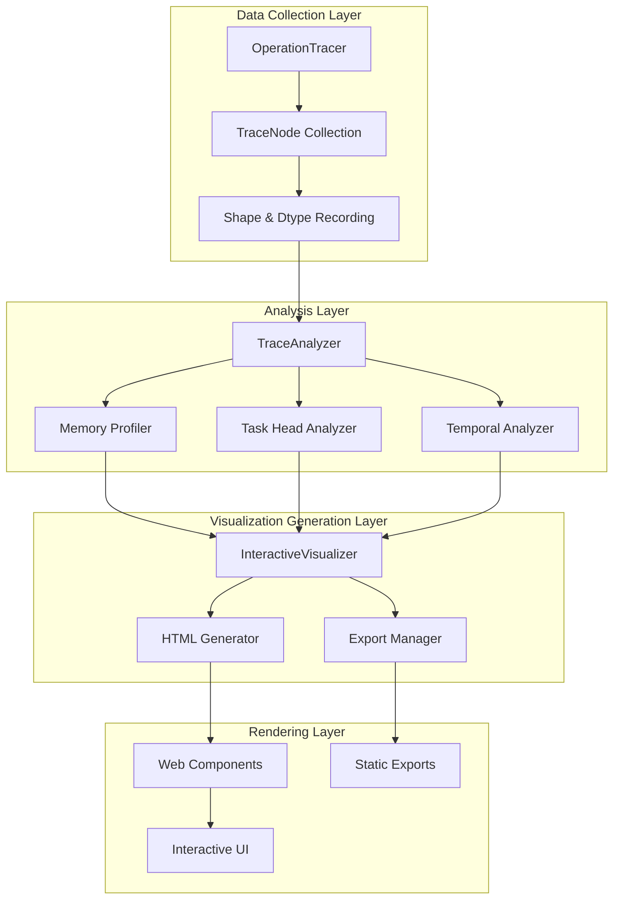

# uniad-dataflow-visualization - Task 29

Execute task 29 for the uniad-dataflow-visualization specification.

## Task Description
Create unit tests for TaskHeadComparator in tests/test_task_head_comparator.py

## Code Reuse
**Leverage existing code**: existing test utilities

## Requirements Reference
**Requirements**: 2.1, 2.2

## Usage
```
/Task:29-uniad-dataflow-visualization
```

## Instructions

Execute with @spec-task-executor agent the following task: "Create unit tests for TaskHeadComparator in tests/test_task_head_comparator.py"

```
Use the @spec-task-executor agent to implement task 29: "Create unit tests for TaskHeadComparator in tests/test_task_head_comparator.py" for the uniad-dataflow-visualization specification and include all the below context.

# Steering Context
## Steering Documents Context

No steering documents found or all are empty.

# Specification Context
## Specification Context (Pre-loaded): uniad-dataflow-visualization

### Requirements
# Requirements Document

## Introduction

The UniAD Dataflow Visualization feature will enhance the existing PyTorch operation tracer to provide comprehensive, interactive dataflow visualization for the UniAD autonomous driving model. This feature will help developers understand the complex multi-task architecture, optimize memory usage, and debug issues by visualizing how data flows through the model's 5 task heads (tracking, segmentation, motion prediction, occupancy, and planning).

## Alignment with Product Vision

This feature supports UniAD's planning-oriented autonomous driving framework by:
- Providing transparency into the hierarchical integration of perception, prediction, and planning tasks
- Enabling optimization of the 30-50GB GPU memory footprint through visual memory profiling
- Supporting the two-stage training strategy with stage-specific visualizations
- Facilitating debugging and development of the multi-task learning architecture

## Requirements

### Requirement 1: Interactive Dataflow Visualization

**User Story:** As a UniAD developer, I want to visualize the complete dataflow through the model, so that I can understand how data transforms across all task heads and identify bottlenecks.

#### Acceptance Criteria

1. WHEN a model trace is generated THEN the system SHALL produce an interactive HTML visualization showing the complete dataflow graph
2. IF a user hovers over a node THEN the system SHALL display tensor shape, dtype, and memory usage information
3. WHEN viewing the dataflow THEN the system SHALL support collapsing/expanding module hierarchies for different levels of detail
4. IF the visualization contains more than 100 nodes THEN the system SHALL provide filtering and search capabilities
5. WHEN a user clicks on a connection THEN the system SHALL highlight the data path and show transformation details

### Requirement 2: Task Head-Specific Analysis

**User Story:** As a UniAD researcher, I want to analyze individual task heads separately, so that I can optimize each component of the multi-task architecture.

#### Acceptance Criteria

1. WHEN analyzing a specific task head THEN the system SHALL isolate and visualize only that head's dataflow
2. IF comparing task heads THEN the system SHALL generate side-by-side visualizations with aligned scales
3. WHEN viewing task head metrics THEN the system SHALL display memory usage, compute time, and operation counts
4. IF a task head has dependencies on other heads THEN the system SHALL clearly mark and visualize these connections

### Requirement 3: Memory Profiling Visualization

**User Story:** As a performance engineer, I want to visualize memory usage patterns, so that I can identify optimization opportunities to reduce the 30-50GB GPU requirement.

#### Acceptance Criteria

1. WHEN viewing memory profiling THEN the system SHALL display a memory timeline graph showing allocation/deallocation patterns
2. IF memory usage exceeds configurable thresholds THEN the system SHALL highlight problematic operations in red
3. WHEN analyzing memory bottlenecks THEN the system SHALL rank operations by memory consumption
4. IF mixed precision is enabled THEN the system SHALL show potential memory savings from dtype conversions

### Requirement 4: Temporal Flow Visualization

**User Story:** As a UniAD developer, I want to visualize how temporal information flows through the model's queue system, so that I can understand and optimize multi-frame processing.

#### Acceptance Criteria

1. WHEN processing multiple frames THEN the system SHALL visualize the temporal aggregation across frames
2. IF queue_length differs between stages THEN the system SHALL adapt visualization to show Stage 1 (5 frames) vs Stage 2 (3 frames)
3. WHEN viewing temporal flow THEN the system SHALL animate or step through frame-by-frame processing
4. IF temporal dependencies exist THEN the system SHALL draw directed edges showing temporal connections

### Requirement 5: Export and Reporting

**User Story:** As a team lead, I want to export visualizations and generate reports, so that I can share findings and track optimization progress.

#### Acceptance Criteria

1. WHEN exporting visualizations THEN the system SHALL support SVG, PNG, and interactive HTML formats
2. IF generating a report THEN the system SHALL include summary statistics, key findings, and optimization recommendations
3. WHEN comparing model versions THEN the system SHALL generate diff visualizations highlighting changes
4. IF exporting for documentation THEN the system SHALL generate Mermaid diagrams compatible with Markdown

## Non-Functional Requirements

### Performance
- Visualization generation SHALL complete within 30 seconds for models up to 1B parameters
- Interactive visualizations SHALL maintain 60 FPS with up to 1000 nodes
- Memory overhead for tracing SHALL not exceed 10% of model memory usage

### Security
- The system SHALL not expose sensitive model weights or proprietary algorithms in visualizations
- Export functions SHALL sanitize file paths and prevent directory traversal
- Generated HTML SHALL use Content Security Policy to prevent XSS attacks

### Reliability
- The system SHALL gracefully handle incomplete traces and provide partial visualizations
- Visualization SHALL work with both Stage 1 and Stage 2 model configurations
- The system SHALL validate input data and provide meaningful error messages

### Usability
- Visualizations SHALL be self-explanatory with clear legends and labels
- The interface SHALL provide tooltips and contextual help
- Color schemes SHALL be colorblind-friendly and configurable
- The system SHALL remember user preferences for visualization settings

---

### Design
# Design Document

## Overview

The UniAD Dataflow Visualization feature enhances the existing PyTorch operation tracer to provide comprehensive, interactive visualization capabilities for the UniAD autonomous driving model. This design builds upon the solid foundation in `tools/pytorch_op_tracer/` by adding interactive HTML visualization, enhanced memory profiling views, and improved export capabilities while maintaining compatibility with the existing tracing infrastructure.

## Steering Document Alignment

### Technical Standards (tech.md)
The design follows UniAD's established technical patterns:
- Modular architecture with clear separation of concerns (analyzers, visualizers, core)
- Python 3.8+ with type hints for all public interfaces
- Dataclass-based data structures for trace information
- Comprehensive error handling with graceful degradation
- Memory-efficient processing suitable for 30-50GB model analysis

### Project Structure (structure.md)
Implementation follows the existing project organization:
- New visualizers in `tools/pytorch_op_tracer/visualizers/`
- Interactive components in `tools/pytorch_op_tracer/web/`
- Extended analyzers in `tools/pytorch_op_tracer/analyzers/`
- Utility functions in `tools/pytorch_op_tracer/utils/`
- Test files in `tools/pytorch_op_tracer/tests/`

## Code Reuse Analysis

### Existing Components to Leverage
- **DataflowVisualizer**: Extend existing Mermaid visualizer with interactive capabilities
- **TraceNode**: Reuse dataclass structure, add visualization metadata fields
- **TraceAnalyzer**: Extend comprehensive analysis with visualization-specific metrics
- **MemoryProfiler**: Enhance with timeline generation and memory heatmap data
- **MultiHeadTracer**: Leverage for task head isolation and comparison
- **TemporalTracer**: Extend for animated temporal flow visualization
- **ModuleHierarchyAnalyzer**: Use for collapsible hierarchy generation

### Integration Points
- **Existing Tracer**: Hook into OperationTracer's trace collection mechanism
- **Report Generation**: Integrate with existing report generation scripts
- **Command Line Interface**: Extend trace_ops.py with new visualization flags
- **Export Pipeline**: Build on existing Mermaid export functionality

## Architecture

The enhanced visualization system follows a layered architecture that separates data collection, analysis, visualization generation, and rendering:



## Components and Interfaces

### InteractiveVisualizer
- **Purpose:** Generate interactive HTML visualizations from trace data
- **Interfaces:** 
  - `generate_interactive_html(trace_nodes, options) -> str`
  - `create_visualization_data(trace_nodes) -> Dict`
  - `apply_filters(data, filters) -> Dict`
- **Dependencies:** TraceAnalyzer, DataflowVisualizer, HTMLTemplateEngine
- **Reuses:** Existing DataflowVisualizer for graph structure generation

### HTMLTemplateEngine
- **Purpose:** Render interactive HTML with embedded JavaScript visualization
- **Interfaces:**
  - `render_template(data, template_name) -> str`
  - `inject_visualization_data(html, data) -> str`
  - `add_interactive_scripts(html) -> str`
- **Dependencies:** Jinja2 templates, D3.js library
- **Reuses:** Existing report HTML generation patterns

### MemoryTimelineVisualizer
- **Purpose:** Create timeline visualizations of memory allocation/deallocation
- **Interfaces:**
  - `generate_timeline(memory_events) -> Dict`
  - `identify_peaks(timeline_data) -> List[Peak]`
  - `calculate_memory_pressure(timeline_data) -> float`
- **Dependencies:** MemoryProfiler, numpy for timeline calculations
- **Reuses:** Existing MemoryProfiler's event tracking

### TaskHeadComparator
- **Purpose:** Generate side-by-side task head comparisons
- **Interfaces:**
  - `compare_heads(head_traces: Dict[str, List]) -> ComparisonData`
  - `align_scales(comparison_data) -> None`
  - `generate_diff_view(head1, head2) -> DiffData`
- **Dependencies:** MultiHeadTracer, visualization scaling utilities
- **Reuses:** MultiHeadTracer's head isolation logic

### ExportManager
- **Purpose:** Handle multiple export formats (SVG, PNG, HTML, Mermaid)
- **Interfaces:**
  - `export_svg(visualization_data, path) -> None`
  - `export_png(visualization_data, path, dpi) -> None`
  - `export_mermaid(trace_nodes, path) -> None`
  - `export_report(analysis_data, path) -> None`
- **Dependencies:** Pillow for image exports, existing Mermaid visualizer
- **Reuses:** DataflowVisualizer's Mermaid generation

### FilterEngine
- **Purpose:** Provide search and filter capabilities for large graphs
- **Interfaces:**
  - `filter_by_module(nodes, module_pattern) -> List[TraceNode]`
  - `filter_by_memory(nodes, threshold) -> List[TraceNode]`
  - `filter_by_operation(nodes, op_types) -> List[TraceNode]`
  - `search_nodes(nodes, query) -> List[TraceNode]`
- **Dependencies:** Regular expressions, trace node metadata
- **Reuses:** Existing node filtering in visualization state

## Data Models

### VisualizationMetadata
```python
@dataclass
class VisualizationMetadata:
    node_id: str  # Unique identifier for visualization
    display_name: str  # Human-readable name
    position: Tuple[float, float]  # X, Y coordinates
    color: str  # Color based on operation type or memory usage
    size: float  # Node size based on importance metric
    expanded: bool  # Whether children are visible
    highlight: bool  # Whether node is highlighted
    tooltip_data: Dict[str, Any]  # Data for hover tooltip
```

### InteractiveConfig
```python
@dataclass
class InteractiveConfig:
    enable_zoom: bool = True
    enable_pan: bool = True
    enable_search: bool = True
    enable_filters: bool = True
    enable_tooltips: bool = True
    enable_export: bool = True
    max_nodes_visible: int = 1000
    animation_duration_ms: int = 300
    color_scheme: str = "memory"  # "memory", "operation", "temporal"
```

### MemoryTimelineEvent
```python
@dataclass
class MemoryTimelineEvent:
    timestamp: float  # Time in ms
    operation: str  # Operation name
    memory_delta: float  # Memory change in MB
    cumulative_memory: float  # Total memory at this point
    module_path: str  # Module that triggered the event
    tensor_info: Optional[Dict]  # Shape and dtype information
```

### ComparisonData
```python
@dataclass
class ComparisonData:
    base_head: str  # Name of base task head
    compare_head: str  # Name of comparison head
    common_operations: List[str]  # Operations in both
    unique_to_base: List[str]  # Operations only in base
    unique_to_compare: List[str]  # Operations only in compare
    memory_diff: float  # Memory difference in MB
    compute_diff: float  # Compute time difference in ms
```

## Error Handling

### Error Scenarios
1. **Large Graph Rendering (>10000 nodes):**
   - **Handling:** Automatically enable progressive rendering and suggest filtering
   - **User Impact:** Warning message with filter suggestions, degraded to static view

2. **Memory Overflow During Visualization:**
   - **Handling:** Fall back to chunked processing and simplified visualization
   - **User Impact:** Notification about reduced detail level, core features preserved

3. **Browser Compatibility Issues:**
   - **Handling:** Detect browser capabilities and provide fallback rendering
   - **User Impact:** Graceful degradation to static Mermaid diagram with export options

4. **Incomplete Trace Data:**
   - **Handling:** Skip missing nodes, mark incomplete sections clearly
   - **User Impact:** Partial visualization with clear indicators of missing data

5. **Export Format Not Supported:**
   - **Handling:** Suggest alternative formats, provide conversion instructions
   - **User Impact:** Clear error message with available format options

## Testing Strategy

### Unit Testing
- Test each visualizer component in isolation
- Validate data transformation accuracy
- Test filter and search algorithms
- Verify export format generation
- Test error handling paths

### Integration Testing
- Test full pipeline from trace to visualization
- Verify component interactions
- Test with Stage 1 and Stage 2 models
- Validate memory profiling accuracy
- Test multi-task head comparisons

### End-to-End Testing
- Load and visualize actual UniAD model traces
- Test interactive features in multiple browsers
- Verify export quality for all formats
- Test performance with large models
- Validate temporal flow animations

### Performance Testing
- Benchmark rendering time for various model sizes
- Test memory usage during visualization generation
- Verify 60 FPS interaction target
- Test progressive rendering effectiveness
- Validate filter performance on large graphs

**Note**: Specification documents have been pre-loaded. Do not use get-content to fetch them again.

## Task Details
- Task ID: 29
- Description: Create unit tests for TaskHeadComparator in tests/test_task_head_comparator.py
- Leverage: existing test utilities
- Requirements: 2.1, 2.2

## Instructions
- Implement ONLY task 29: "Create unit tests for TaskHeadComparator in tests/test_task_head_comparator.py"
- Follow all project conventions and leverage existing code
- Mark the task as complete using: claude-code-spec-workflow get-tasks uniad-dataflow-visualization 29 --mode complete
- Provide a completion summary
```

## Task Completion
When the task is complete, mark it as done:
```bash
claude-code-spec-workflow get-tasks uniad-dataflow-visualization 29 --mode complete
```

## Next Steps
After task completion, you can:
- Execute the next task using /uniad-dataflow-visualization-task-[next-id]
- Check overall progress with /spec-status uniad-dataflow-visualization
