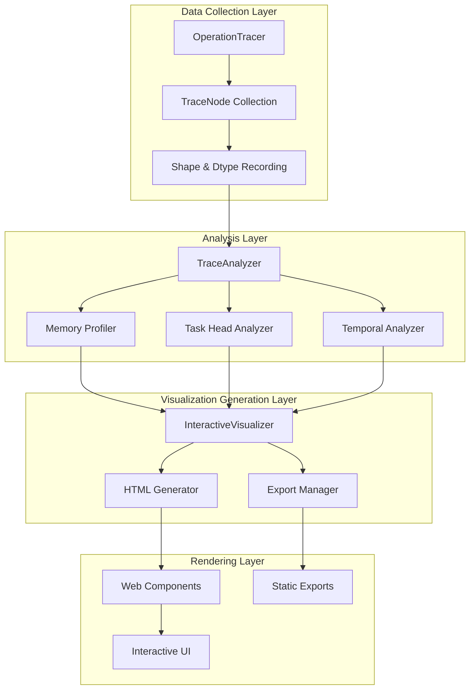

# Design Document

## Overview

The UniAD Dataflow Visualization feature enhances the existing PyTorch operation tracer to provide comprehensive, interactive visualization capabilities for the UniAD autonomous driving model. This design builds upon the solid foundation in `tools/pytorch_op_tracer/` by adding interactive HTML visualization, enhanced memory profiling views, and improved export capabilities while maintaining compatibility with the existing tracing infrastructure.

## Steering Document Alignment

### Technical Standards (tech.md)
The design follows UniAD's established technical patterns:
- Modular architecture with clear separation of concerns (analyzers, visualizers, core)
- Python 3.8+ with type hints for all public interfaces
- Dataclass-based data structures for trace information
- Comprehensive error handling with graceful degradation
- Memory-efficient processing suitable for 30-50GB model analysis

### Project Structure (structure.md)
Implementation follows the existing project organization:
- New visualizers in `tools/pytorch_op_tracer/visualizers/`
- Interactive components in `tools/pytorch_op_tracer/web/`
- Extended analyzers in `tools/pytorch_op_tracer/analyzers/`
- Utility functions in `tools/pytorch_op_tracer/utils/`
- Test files in `tools/pytorch_op_tracer/tests/`

## Code Reuse Analysis

### Existing Components to Leverage
- **DataflowVisualizer**: Extend existing Mermaid visualizer with interactive capabilities
- **TraceNode**: Reuse dataclass structure, add visualization metadata fields
- **TraceAnalyzer**: Extend comprehensive analysis with visualization-specific metrics
- **MemoryProfiler**: Enhance with timeline generation and memory heatmap data
- **MultiHeadTracer**: Leverage for task head isolation and comparison
- **TemporalTracer**: Extend for animated temporal flow visualization
- **ModuleHierarchyAnalyzer**: Use for collapsible hierarchy generation

### Integration Points
- **Existing Tracer**: Hook into OperationTracer's trace collection mechanism
- **Report Generation**: Integrate with existing report generation scripts
- **Command Line Interface**: Extend trace_ops.py with new visualization flags
- **Export Pipeline**: Build on existing Mermaid export functionality

## Architecture

The enhanced visualization system follows a layered architecture that separates data collection, analysis, visualization generation, and rendering:



## Components and Interfaces

### InteractiveVisualizer
- **Purpose:** Generate interactive HTML visualizations from trace data
- **Interfaces:** 
  - `generate_interactive_html(trace_nodes, options) -> str`
  - `create_visualization_data(trace_nodes) -> Dict`
  - `apply_filters(data, filters) -> Dict`
- **Dependencies:** TraceAnalyzer, DataflowVisualizer, HTMLTemplateEngine
- **Reuses:** Existing DataflowVisualizer for graph structure generation

### HTMLTemplateEngine
- **Purpose:** Render interactive HTML with embedded JavaScript visualization
- **Interfaces:**
  - `render_template(data, template_name) -> str`
  - `inject_visualization_data(html, data) -> str`
  - `add_interactive_scripts(html) -> str`
- **Dependencies:** Jinja2 templates, D3.js library
- **Reuses:** Existing report HTML generation patterns

### MemoryTimelineVisualizer
- **Purpose:** Create timeline visualizations of memory allocation/deallocation
- **Interfaces:**
  - `generate_timeline(memory_events) -> Dict`
  - `identify_peaks(timeline_data) -> List[Peak]`
  - `calculate_memory_pressure(timeline_data) -> float`
- **Dependencies:** MemoryProfiler, numpy for timeline calculations
- **Reuses:** Existing MemoryProfiler's event tracking

### TaskHeadComparator
- **Purpose:** Generate side-by-side task head comparisons
- **Interfaces:**
  - `compare_heads(head_traces: Dict[str, List]) -> ComparisonData`
  - `align_scales(comparison_data) -> None`
  - `generate_diff_view(head1, head2) -> DiffData`
- **Dependencies:** MultiHeadTracer, visualization scaling utilities
- **Reuses:** MultiHeadTracer's head isolation logic

### ExportManager
- **Purpose:** Handle multiple export formats (SVG, PNG, HTML, Mermaid)
- **Interfaces:**
  - `export_svg(visualization_data, path) -> None`
  - `export_png(visualization_data, path, dpi) -> None`
  - `export_mermaid(trace_nodes, path) -> None`
  - `export_report(analysis_data, path) -> None`
- **Dependencies:** Pillow for image exports, existing Mermaid visualizer
- **Reuses:** DataflowVisualizer's Mermaid generation

### FilterEngine
- **Purpose:** Provide search and filter capabilities for large graphs
- **Interfaces:**
  - `filter_by_module(nodes, module_pattern) -> List[TraceNode]`
  - `filter_by_memory(nodes, threshold) -> List[TraceNode]`
  - `filter_by_operation(nodes, op_types) -> List[TraceNode]`
  - `search_nodes(nodes, query) -> List[TraceNode]`
- **Dependencies:** Regular expressions, trace node metadata
- **Reuses:** Existing node filtering in visualization state

## Data Models

### VisualizationMetadata
```python
@dataclass
class VisualizationMetadata:
    node_id: str  # Unique identifier for visualization
    display_name: str  # Human-readable name
    position: Tuple[float, float]  # X, Y coordinates
    color: str  # Color based on operation type or memory usage
    size: float  # Node size based on importance metric
    expanded: bool  # Whether children are visible
    highlight: bool  # Whether node is highlighted
    tooltip_data: Dict[str, Any]  # Data for hover tooltip
```

### InteractiveConfig
```python
@dataclass
class InteractiveConfig:
    enable_zoom: bool = True
    enable_pan: bool = True
    enable_search: bool = True
    enable_filters: bool = True
    enable_tooltips: bool = True
    enable_export: bool = True
    max_nodes_visible: int = 1000
    animation_duration_ms: int = 300
    color_scheme: str = "memory"  # "memory", "operation", "temporal"
```

### MemoryTimelineEvent
```python
@dataclass
class MemoryTimelineEvent:
    timestamp: float  # Time in ms
    operation: str  # Operation name
    memory_delta: float  # Memory change in MB
    cumulative_memory: float  # Total memory at this point
    module_path: str  # Module that triggered the event
    tensor_info: Optional[Dict]  # Shape and dtype information
```

### ComparisonData
```python
@dataclass
class ComparisonData:
    base_head: str  # Name of base task head
    compare_head: str  # Name of comparison head
    common_operations: List[str]  # Operations in both
    unique_to_base: List[str]  # Operations only in base
    unique_to_compare: List[str]  # Operations only in compare
    memory_diff: float  # Memory difference in MB
    compute_diff: float  # Compute time difference in ms
```

## Error Handling

### Error Scenarios
1. **Large Graph Rendering (>10000 nodes):**
   - **Handling:** Automatically enable progressive rendering and suggest filtering
   - **User Impact:** Warning message with filter suggestions, degraded to static view

2. **Memory Overflow During Visualization:**
   - **Handling:** Fall back to chunked processing and simplified visualization
   - **User Impact:** Notification about reduced detail level, core features preserved

3. **Browser Compatibility Issues:**
   - **Handling:** Detect browser capabilities and provide fallback rendering
   - **User Impact:** Graceful degradation to static Mermaid diagram with export options

4. **Incomplete Trace Data:**
   - **Handling:** Skip missing nodes, mark incomplete sections clearly
   - **User Impact:** Partial visualization with clear indicators of missing data

5. **Export Format Not Supported:**
   - **Handling:** Suggest alternative formats, provide conversion instructions
   - **User Impact:** Clear error message with available format options

## Testing Strategy

### Unit Testing
- Test each visualizer component in isolation
- Validate data transformation accuracy
- Test filter and search algorithms
- Verify export format generation
- Test error handling paths

### Integration Testing
- Test full pipeline from trace to visualization
- Verify component interactions
- Test with Stage 1 and Stage 2 models
- Validate memory profiling accuracy
- Test multi-task head comparisons

### End-to-End Testing
- Load and visualize actual UniAD model traces
- Test interactive features in multiple browsers
- Verify export quality for all formats
- Test performance with large models
- Validate temporal flow animations

### Performance Testing
- Benchmark rendering time for various model sizes
- Test memory usage during visualization generation
- Verify 60 FPS interaction target
- Test progressive rendering effectiveness
- Validate filter performance on large graphs