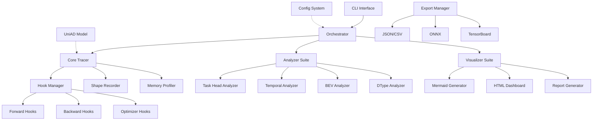

# Design Document

## Overview

The UniAD Model Analyzer is a comprehensive PyTorch model analysis tool specifically designed for the UniAD autonomous driving model. It provides deep insights into the model's multi-task architecture through operation tracing, memory profiling, and visualization. The tool leverages modern PyTorch profiling best practices including automated trace collection, hook-based analysis, and interactive visualizations to help developers optimize UniAD's complex 5-head architecture and manage its significant memory requirements (30-50GB GPU).

## Steering Document Alignment

### Technical Standards (tech.md)
Since no steering documents exist, the design follows PyTorch and autonomous driving industry best practices:
- PyTorch's official profiling and hook APIs for minimal intrusion
- Automated trace collection patterns from Meta's Dynolog approach
- Mixed precision analysis aligned with NVIDIA's autonomous driving optimization strategies
- Modular architecture following PyTorch ecosystem conventions

### Project Structure (structure.md)
The implementation follows UniAD's existing structure patterns:
- Tool placement in `tools/` directory alongside existing analysis tools
- Module organization mirroring UniAD's plugin architecture
- Configuration patterns consistent with MMDetection3D framework
- Integration with existing visualization tools in `tools/analysis_tools/`

## Code Reuse Analysis

### Existing Components to Leverage
- **MMDetection3D Config System**: Reuse UniAD's configuration infrastructure for analyzer settings
- **UniAD Model Classes**: Direct integration with `UniADTrack` and `UniAD` detectors
- **Visualization Base Classes**: Extend `tools/analysis_tools/visualize/render/base_render.py`
- **NuScenes Integration**: Leverage existing dataset handling for test data generation
- **CUDA Utilities**: Reuse existing GPU memory management patterns from training scripts

### Integration Points
- **Model Loading**: Hook into existing checkpoint loading from `tools/test.py`
- **Configuration**: Integrate with UniAD's config system in `projects/configs/`
- **Task Heads**: Direct access to the 5 task heads through model's modular architecture
- **Benchmarking**: Extend `tools/analysis_tools/benchmark.py` patterns for performance metrics

## Architecture

The analyzer follows a layered architecture with clear separation of concerns, enabling independent testing and extensibility.

### Modular Design Principles
- **Single File Responsibility**: Each module handles one analysis aspect (tracing, profiling, visualization)
- **Component Isolation**: Core tracer, analyzers, and visualizers operate independently
- **Service Layer Separation**: Clear boundaries between data collection, analysis, and presentation
- **Utility Modularity**: Shared utilities for tensor operations, memory calculations, and formatting



## Components and Interfaces

### Component 1: Core Tracer (`core/tracer.py`)
- **Purpose:** Central orchestration of PyTorch operation tracing with UniAD-specific enhancements
- **Interfaces:** 
  - `trace_model(model, inputs, config)`: Main tracing entry point
  - `register_hooks(module, recursive=True)`: Hook registration system
  - `get_trace_graph()`: Returns traced operation graph
- **Dependencies:** PyTorch hooks API, memory profiler, shape recorder
- **Reuses:** PyTorch's `register_forward_hook`, `register_full_backward_hook` APIs

### Component 2: Hook Manager (`core/hook_manager.py`)
- **Purpose:** Manages forward/backward hooks with minimal overhead following Meta's automated trace patterns
- **Interfaces:**
  - `register_module_hooks(module, hook_config)`: Register hooks with configuration
  - `register_optimizer_hooks(optimizer)`: Optimizer boundary tracing
  - `cleanup_hooks()`: Safe hook removal
- **Dependencies:** PyTorch module system, profiler integration
- **Reuses:** PyTorch's hook infrastructure with `torch.profiler.record_function`

### Component 3: Shape Recorder (`core/shape_recorder.py`)
- **Purpose:** Efficient tensor shape and dtype tracking with memory-aware caching
- **Interfaces:**
  - `record_tensor(tensor, context)`: Record tensor metadata
  - `get_shape_transformations()`: Analyze shape changes through network
  - `export_shape_data()`: Export shape analysis results
- **Dependencies:** NumPy for efficient storage, tensor metadata APIs
- **Reuses:** PyTorch tensor properties, memory format utilities

### Component 4: Multi-Head Analyzer (`analyzers/multi_head_analyzer.py`)
- **Purpose:** Specialized analysis for UniAD's 5 task heads with cross-head dependency tracking
- **Interfaces:**
  - `analyze_task_head(head_name, trace_data)`: Per-head analysis
  - `analyze_head_interactions()`: Cross-head dependency analysis
  - `compute_head_metrics()`: Memory, compute, parameter metrics per head
- **Dependencies:** Core tracer output, UniAD head modules
- **Reuses:** UniAD's task head classes (BEVFormerTrackHead, PansegformerHead, etc.)

### Component 5: Temporal Analyzer (`analyzers/temporal_analyzer.py`)
- **Purpose:** Analyze multi-frame temporal aggregation patterns (3-5 frames)
- **Interfaces:**
  - `analyze_temporal_flow(trace_data, num_frames)`: Frame-to-frame analysis
  - `analyze_queue_memory(queue_length)`: Memory scaling with temporal frames
  - `visualize_temporal_attention()`: Attention pattern visualization
- **Dependencies:** BEV encoder traces, temporal self-attention modules
- **Reuses:** UniAD's temporal aggregation modules

### Component 6: BEV Analyzer (`analyzers/bev_analyzer.py`)
- **Purpose:** Specialized analysis for BEVFormer operations and spatial transformations
- **Interfaces:**
  - `analyze_bev_encoder(trace_data)`: BEV encoder profiling
  - `analyze_spatial_transform()`: Multi-view to BEV projection analysis
  - `verify_frozen_encoder(stage)`: Confirm gradient blocking in Stage 2
- **Dependencies:** BEVFormer modules, spatial attention patterns
- **Reuses:** UniAD's BEV encoder implementation

### Component 7: Memory Profiler (`analyzers/memory_profiler.py`)
- **Purpose:** Detailed memory analysis with activation/parameter separation
- **Interfaces:**
  - `profile_memory_usage(trace_data)`: Complete memory profiling
  - `identify_memory_bottlenecks()`: Find top memory consumers
  - `suggest_optimizations()`: Memory optimization recommendations
- **Dependencies:** CUDA memory APIs, PyTorch memory profiler
- **Reuses:** PyTorch's memory profiling infrastructure

### Component 8: DType Analyzer (`analyzers/dtype_analyzer.py`)
- **Purpose:** Data type analysis and mixed precision optimization recommendations
- **Interfaces:**
  - `analyze_dtype_distribution(trace_data)`: Type distribution analysis
  - `simulate_mixed_precision(config)`: Predict memory/compute savings
  - `recommend_quantization()`: Layer-specific precision recommendations
- **Dependencies:** Tensor dtype tracking, precision simulation
- **Reuses:** PyTorch's autocast and AMP utilities

### Component 9: Mermaid Visualizer (`visualizers/mermaid_visualizer.py`)
- **Purpose:** Generate interactive Mermaid diagrams with hierarchical views
- **Interfaces:**
  - `generate_dataflow_diagram(trace_data, options)`: Create Mermaid diagram
  - `create_hierarchical_view(module_tree)`: Expandable module visualization
  - `annotate_with_metadata(shapes, dtypes)`: Add tensor metadata
- **Dependencies:** Mermaid syntax generator, graph layout algorithms
- **Reuses:** Existing visualization patterns from analysis tools

### Component 10: Report Generator (`visualizers/report_generator.py`)
- **Purpose:** Comprehensive Markdown/HTML report generation with insights
- **Interfaces:**
  - `generate_report(analysis_results, format)`: Create full report
  - `create_summary_section()`: Executive summary with key findings
  - `generate_recommendations()`: Actionable optimization suggestions
- **Dependencies:** Markdown/HTML templating, chart generation
- **Reuses:** Report patterns from existing tools

### Component 11: Export Manager (`export/export_manager.py`)
- **Purpose:** Export analysis results in various formats for integration
- **Interfaces:**
  - `export_json(data, path)`: JSON export for programmatic access
  - `export_tensorboard(trace_data)`: TensorBoard integration
  - `export_onnx_trace(model, trace)`: ONNX conversion analysis
- **Dependencies:** JSON, CSV libraries, TensorBoard writer
- **Reuses:** PyTorch's ONNX export utilities

## Data Models

### TraceNode
```python
@dataclass
class TraceNode:
    # Core identification
    id: str                          # Unique node identifier
    name: str                        # Operation/module name
    module_path: str                 # Full module path in model
    
    # Timing and memory
    start_time: float                # Operation start time (ns)
    duration: float                  # Execution duration (ns)
    memory_allocated: int            # Memory allocated (bytes)
    memory_freed: int               # Memory freed (bytes)
    
    # Tensor information
    input_shapes: List[TensorShape]  # Input tensor shapes
    output_shapes: List[TensorShape] # Output tensor shapes
    input_dtypes: List[torch.dtype]  # Input data types
    output_dtypes: List[torch.dtype] # Output data types
    
    # UniAD-specific
    task_head: Optional[str]         # Associated task head (track/seg/motion/occ/planning)
    temporal_frame: Optional[int]    # Temporal frame index (0-4)
    bev_operation: bool              # Is BEV-related operation
    
    # Graph structure
    parent: Optional[str]            # Parent node ID
    children: List[str]              # Child node IDs
    dependencies: List[str]          # Cross-branch dependencies
```

### AnalysisConfig
```python
@dataclass 
class AnalysisConfig:
    # Model configuration
    model_config: str                # Path to UniAD config file
    checkpoint: Optional[str]        # Model checkpoint path
    stage: int                       # UniAD stage (1 or 2)
    
    # Tracing options
    trace_forward: bool = True       # Trace forward pass
    trace_backward: bool = False     # Trace backward pass
    trace_optimizer: bool = False    # Trace optimizer steps
    task_heads: List[str] = field(default_factory=list)  # Specific heads to trace
    
    # Analysis options
    profile_memory: bool = True      # Enable memory profiling
    track_shapes: bool = True        # Track tensor shapes
    track_dtypes: bool = True        # Track data types
    analyze_bev: bool = True         # BEV-specific analysis
    temporal_frames: int = 3         # Number of temporal frames
    
    # Visualization options
    generate_mermaid: bool = True    # Generate Mermaid diagrams
    hierarchical_view: bool = True   # Enable expandable views
    max_diagram_nodes: int = 50      # Maximum nodes in diagram
    
    # Export options
    export_formats: List[str] = field(default_factory=lambda: ['json', 'markdown'])
    output_dir: str = './analysis_results'
```

### MemoryProfile
```python
@dataclass
class MemoryProfile:
    # Overall statistics
    peak_allocated: int              # Peak memory allocation (bytes)
    peak_reserved: int               # Peak reserved memory (bytes)
    
    # Breakdown by component
    activation_memory: Dict[str, int]     # Memory for activations
    parameter_memory: Dict[str, int]      # Memory for parameters
    gradient_memory: Dict[str, int]       # Memory for gradients
    optimizer_memory: Dict[str, int]      # Memory for optimizer states
    
    # Task head breakdown
    task_head_memory: Dict[str, int]      # Memory per task head
    
    # Temporal breakdown
    temporal_memory: List[int]            # Memory per temporal frame
    
    # Optimization potential
    fp16_savings: int                     # Potential FP16 savings
    int8_savings: int                     # Potential INT8 savings
    pruning_savings: int                  # Potential pruning savings
```

## Error Handling

### Error Scenarios

1. **Model Loading Failure**
   - **Handling:** Validate checkpoint compatibility, provide clear error about version mismatch
   - **User Impact:** Clear message about required checkpoint format and compatible versions

2. **Out of Memory During Tracing**
   - **Handling:** Implement incremental tracing with checkpointing, suggest reduced batch size
   - **User Impact:** Automatic recovery with reduced scope, memory optimization suggestions

3. **Incompatible Model Architecture**
   - **Handling:** Detect non-UniAD models, validate required task heads presence
   - **User Impact:** Informative error about model requirements with architecture details

4. **Hook Registration Failure**
   - **Handling:** Fallback to manual instrumentation, warn about reduced functionality
   - **User Impact:** Degraded analysis with explanation of limitations

5. **Visualization Generation Failure**
   - **Handling:** Provide text-based fallback, export raw data for manual analysis
   - **User Impact:** Alternative output formats with instructions for manual visualization

## Testing Strategy

### Unit Testing
- **Hook Manager Tests**: Verify correct hook registration/removal without side effects
- **Shape Recorder Tests**: Validate shape tracking accuracy and memory efficiency
- **Analyzer Tests**: Test each analyzer independently with mock trace data
- **Export Tests**: Verify format compliance and data integrity

### Integration Testing
- **End-to-End Tracing**: Test complete tracing pipeline with small UniAD models
- **Multi-Head Integration**: Verify correct analysis across all 5 task heads
- **Stage Comparison**: Test Stage 1 vs Stage 2 analysis differences
- **Memory Profiling**: Validate memory measurements against ground truth

### End-to-End Testing
- **Full Model Analysis**: Complete analysis of pre-trained UniAD models
- **Performance Benchmarks**: Ensure <20% overhead on model execution
- **Report Generation**: Verify comprehensive reports with all visualizations
- **Export Pipeline**: Test integration with TensorBoard and ONNX export