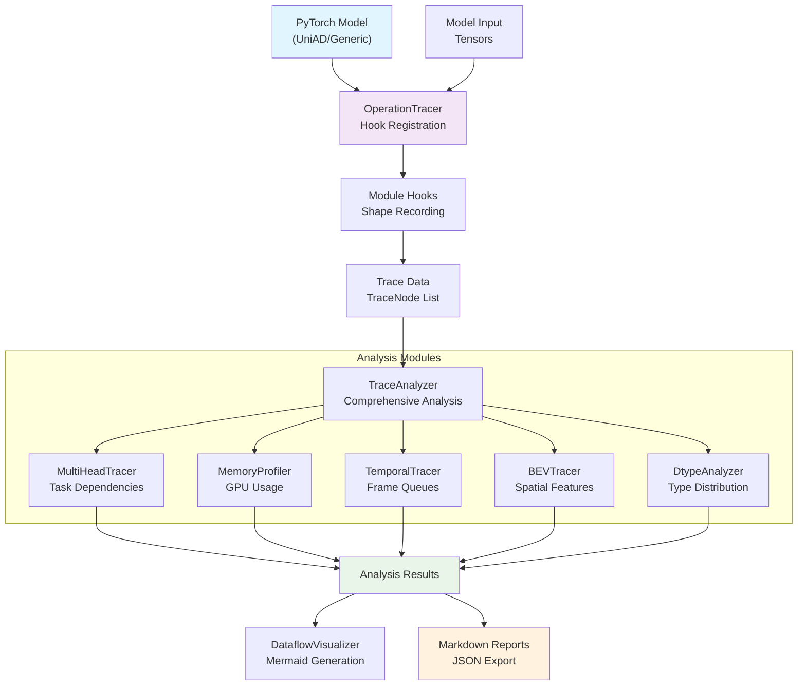

# PyTorch Operation Tracer - Project Documentation INDEX

A comprehensive tool for tracing, analyzing, and visualizing PyTorch operations with specialized support for UniAD's multi-task autonomous driving architecture.

## 📋 Documentation Navigation

### 🚀 [Quick Start](#quick-start)
- [Installation](#installation)
- [Basic Usage](#basic-usage)
- [First Examples](#first-examples)

### 📖 [Core Documentation](#core-documentation)
- [Project Overview](#project-overview)
- [Architecture Guide](#architecture-guide)
- [API Reference](#api-reference)
- [CLI Reference](#cli-reference)

### 🔧 [User Guides](#user-guides)
- [Feature Guide](#feature-guide)
- [Usage Examples](#usage-examples)
- [Configuration](#configuration)
- [Troubleshooting](#troubleshooting)

### 🏗️ [Developer Documentation](#developer-documentation)
- [Contributing](#contributing)
- [Testing](#testing)
- [Extending the Tool](#extending-the-tool)

### 📊 [Analysis Reports](#analysis-reports)
- [Generated Reports](#generated-reports)
- [Report Structure](#report-structure)

---

## Quick Start

### Installation

#### Option 1: Install as Package (Recommended)
```bash
# Clone the UniAD repository
git clone https://github.com/OpenDriveLab/UniAD.git
cd UniAD/tools/pytorch_op_tracer

# Install the package
pip install -e .

# With visualization support
pip install -e ".[visualization]"

# With full UniAD support
pip install -e ".[uniad]"
```

#### Option 2: Direct Usage
```bash
# Add to Python path
export PYTHONPATH=$PYTHONPATH:/path/to/UniAD/tools/pytorch_op_tracer

# Run directly
python trace_ops.py --help
```

### Basic Usage

```bash
# Trace a UniAD model
pytorch-trace --config projects/configs/stage2_e2e/base_e2e.py \
              --checkpoint ckpts/uniad_base_e2e.pth \
              --output trace_analysis.md

# Test mode without UniAD dependencies
pytorch-trace --test-mode --output test_trace.md
```

### First Examples

#### Example 1: Basic UniAD Tracing
```bash
pytorch-trace --config projects/configs/stage2_e2e/base_e2e.py \
              --checkpoint ckpts/uniad_base_e2e.pth \
              --stage 2 \
              --show-shapes \
              --output my_first_trace.md
```

#### Example 2: Memory Analysis
```bash
pytorch-trace --config projects/configs/stage2_e2e/base_e2e.py \
              --checkpoint ckpts/uniad_base_e2e.pth \
              --memory-profile \
              --dtype-memory-analysis \
              --output memory_analysis.md
```

#### Example 3: Shape Transformation Analysis
```bash
pytorch-trace --config projects/configs/stage2_e2e/base_e2e.py \
              --checkpoint ckpts/uniad_base_e2e.pth \
              --track-shape-changes \
              --shape-format semantic \
              --output shape_analysis.md
```

---

## Core Documentation

### Project Overview

The PyTorch Operation Tracer is a comprehensive analysis tool specifically designed for understanding and optimizing deep neural networks, with specialized features for UniAD's multi-task autonomous driving architecture.

#### Key Features
- **Operation Tracing**: Hooks into PyTorch modules to trace all forward operations
- **UniAD-Specific Support**: Specialized tracking for UniAD's 5 task heads (track, seg, motion, occ, planning)
- **Memory Profiling**: Critical for understanding UniAD's 30-50GB GPU memory usage
- **Data Type Analysis**: Comprehensive dtype tracking (fp32, fp16, bf16, int8) with memory impact
- **Temporal Analysis**: Visualize multi-frame temporal queue processing
- **BEV Feature Tracking**: Specialized analysis for BEV encoder/decoder operations
- **Mermaid Visualization**: Generate clear dataflow diagrams with tensor shape and dtype annotations
- **Enhanced Profiling**: Low-level kernel and hardware operation decomposition
- **ONNX Dataflow**: Alternative model architecture analysis
- **Hierarchical Module Analysis**: Top-level and expandable detailed views

#### Supported Models
- **Primary**: UniAD (Stage 1: perception, Stage 2: end-to-end)
- **Generic**: Any PyTorch model with customizable tracing

#### Use Cases
- Understanding model architecture and data flow
- Memory usage optimization (critical for UniAD's high memory requirements)
- Performance bottleneck identification
- Mixed precision training strategy planning
- Model debugging and validation
- Research and educational purposes

### Architecture Guide

The tracer is built with a modular architecture consisting of several key components:

#### Core Components
```
pytorch_op_tracer/
├── core/                          # Core tracing functionality
│   ├── tracer.py                  # Main OperationTracer class
│   ├── data_structures.py         # TraceNode and TensorInfo structures
│   ├── shape_recorder.py          # Tensor shape and dtype recording
│   ├── enhanced_profiler.py       # PyTorch Profiler integration
│   ├── operation_decomposition.py # Low-level operation analysis
│   ├── hierarchy_analyzer.py      # Module hierarchy detection
│   └── visualization_state.py     # Visualization configuration
├── analyzers/                     # Analysis modules
│   ├── trace_analyzer.py          # Main analysis coordinator
│   ├── multi_head_analyzer.py     # UniAD task head analysis
│   ├── temporal_analyzer.py       # Temporal queue analysis
│   ├── bev_analyzer.py           # BEV feature analysis
│   ├── memory_profiler.py        # Memory usage profiling
│   └── dtype_analyzer.py         # Data type analysis
├── visualizers/                   # Visualization modules
│   └── mermaid_visualizer.py      # Mermaid diagram generation
├── utils/                         # Utilities
│   └── model_utils.py            # Model loading utilities
└── tests/                         # Test suite
    ├── test_tracer.py
    ├── test_visualization.py
    └── test_report_generation.py
```

#### Data Flow Architecture


#### Key Classes

**OperationTracer** (`core/tracer.py`)
- Main tracing class that hooks into PyTorch modules
- Records operation sequences with timing and memory information
- UniAD-aware task head detection
- Stage-specific handling (Stage 1 vs Stage 2)

**TraceNode** (`core/data_structures.py`)
- Core data structure representing a single traced operation
- Contains tensor shapes, data types, memory usage, and UniAD-specific metadata
- Supports hierarchical module relationships

**TraceAnalyzer** (`analyzers/trace_analyzer.py`)
- Coordinates comprehensive analysis across all analyzer modules
- Produces unified analysis results with cross-module insights

**DataflowVisualizer** (`visualizers/mermaid_visualizer.py`)
- Generates Mermaid diagrams from trace data
- Supports hierarchical visualization with module expansion
- Handles tensor shape and data type annotations

### API Reference

#### Core API

**OperationTracer Class**
```python
from pytorch_op_tracer import OperationTracer

tracer = OperationTracer(
    model: nn.Module,                    # Model to trace
    trace_backward: bool = False,        # Trace backward pass
    filter_ops: List[str] = None,        # Filter specific operations
    stage: int = 2,                      # UniAD stage (1 or 2)
    task_heads: List[str] = None         # Task heads to focus on
)

# Register hooks and perform tracing
tracer.register_hooks()
trace_nodes = tracer.trace(inputs)
tracer.remove_hooks()
```

**TraceAnalyzer Class**
```python
from pytorch_op_tracer import TraceAnalyzer

analyzer = TraceAnalyzer()
analysis = analyzer.analyze(
    trace_nodes: List[TraceNode],        # Trace data
    stage: int = 2                       # UniAD stage
)

# Analysis results structure:
# {
#   'summary': {...},                    # Overall statistics
#   'head_analysis': {...},              # Task head breakdown
#   'temporal_analysis': {...},          # Temporal flow analysis
#   'bev_analysis': {...},              # BEV operations analysis
#   'memory_profile': {...},            # Memory usage profile
#   'dtype_analysis': {...}             # Data type analysis
# }
```

**DataflowVisualizer Class**
```python
from pytorch_op_tracer import DataflowVisualizer

visualizer = DataflowVisualizer(
    max_nodes: int = 50,                 # Maximum nodes to display
    visualization_mode: str = 'top-level', # 'top-level', 'expanded', 'full'
    expand_modules: List[str] = None,    # Modules to expand
    show_shapes: bool = True,            # Show tensor shapes
    shape_format: str = 'full'           # 'full', 'compact', 'semantic'
)

mermaid_diagram = visualizer.generate_mermaid(
    trace_nodes: List[TraceNode],
    analysis: Dict[str, Any]
)
```

#### Specialized Analyzers

**MultiHeadTracer** - UniAD task head analysis
```python
from pytorch_op_tracer.analyzers import MultiHeadTracer

multi_head = MultiHeadTracer()
head_analysis = multi_head.analyze_head_interactions(trace_nodes)
```

**MemoryProfiler** - GPU memory usage analysis
```python
from pytorch_op_tracer.analyzers import MemoryProfiler

profiler = MemoryProfiler()
memory_profile = profiler.profile_memory(trace_nodes)
```

**DtypeAnalyzer** - Data type distribution analysis
```python
from pytorch_op_tracer.analyzers import DtypeAnalyzer

dtype_analyzer = DtypeAnalyzer()
dtype_analysis = dtype_analyzer.analyze_dtype_usage(trace_nodes)
```

#### Utility Functions

**Model Loading Utilities**
```python
from pytorch_op_tracer.utils import load_uniad_model, create_dummy_input

# Load UniAD model from config
model = load_uniad_model(config_path, checkpoint_path, stage=2)

# Create dummy input tensors
inputs = create_dummy_input(stage=2, batch_size=1, num_frames=3)
```

### CLI Reference

The command-line interface provides comprehensive options for model tracing and analysis:

#### Basic Command Structure
```bash
pytorch-trace [MODEL_OPTIONS] [TRACING_OPTIONS] [ANALYSIS_OPTIONS] [OUTPUT_OPTIONS]
```

#### Model Configuration Options
- `--config PATH`: Path to UniAD config file (required for UniAD models)
- `--checkpoint PATH`: Path to model checkpoint
- `--stage {1,2}`: UniAD stage (1: perception, 2: end-to-end)
- `--test-mode`: Run with dummy model for testing

#### Tracing Options
- `--task-heads LIST`: Task heads to trace (default: all)
- `--temporal-frames INT`: Number of temporal frames (default: 3)
- `--trace-backward`: Trace backward pass
- `--filter-ops LIST`: Filter specific operations
- `--max-nodes INT`: Maximum nodes to visualize (default: 50)

#### Visualization Options
- `--visualization-mode {top-level,expanded,full}`: Visualization detail level
- `--expand-modules LIST`: Specific modules to expand
- `--expand-pattern PATTERN`: Pattern for module expansion (e.g., "*Head")
- `--expand-depth INT`: Depth to expand modules
- `--expand-heavy-modules`: Auto-expand modules using >1GB memory
- `--memory-threshold FLOAT`: Memory threshold in MB for auto-expansion

#### Shape Display Options
- `--show-shapes/--no-shapes`: Enable/disable tensor shape display
- `--shape-format {full,compact,semantic}`: Tensor shape display format
- `--track-shape-changes`: Track and highlight shape transformations
- `--highlight-reshapes`: Highlight reshape operations
- `--annotate-memory-per-element`: Show memory usage per tensor element

#### Data Type Options
- `--show-dtype/--no-dtype`: Enable/disable data type display
- `--track-dtype`: Track data type conversions
- `--mixed-precision {fp16,bf16,int8}`: Simulate mixed precision
- `--dtype-memory-analysis`: Analyze memory impact of different data types

#### Analysis Options
- `--memory-profile`: Enable detailed memory profiling
- `--bev-focus`: Focus analysis on BEV operations
- `--visualize-temporal`: Visualize temporal flow

#### Output Options
- `--output PATH`: Output file path (default: trace_output.md)
- `--export-json`: Export trace data as JSON
- `--device {cuda,cpu}`: Device to run on

---

## User Guides

### Feature Guide

#### 1. Operation Tracing
The core functionality traces all PyTorch operations during model execution:

**Features:**
- Module-level hooks for comprehensive operation capture
- Execution order tracking
- Input/output tensor shape recording
- Memory allocation tracking
- Compute time measurement

**UniAD-Specific:**
- Automatic task head detection (track, seg, motion, occ, planning)
- Stage-aware tracing (different handling for Stage 1 vs Stage 2)
- Temporal queue operation tracking
- BEV feature transformation monitoring

#### 2. Memory Profiling
Critical for understanding and optimizing UniAD's high memory usage:

**Capabilities:**
- GPU memory allocation tracking per operation
- Memory usage heatmaps
- Peak memory identification
- Memory bottleneck detection
- Stage comparison (Stage 1: ~50GB vs Stage 2: ~17GB)

**Use Cases:**
- Optimizing memory usage for different GPU configurations
- Understanding memory patterns across task heads
- Planning mixed precision strategies

#### 3. Data Type Analysis
Comprehensive analysis of tensor data types and memory impact:

**Features:**
- Data type distribution across operations
- Memory impact analysis (fp32 vs fp16 vs bf16 vs int8)
- Mixed precision opportunity identification
- Data type conversion tracking

**Memory Impact Table:**
| Data Type | Bytes/Element | Memory Reduction vs FP32 |
|-----------|---------------|--------------------------|
| float32   | 4             | 0% (baseline)            |
| float16   | 2             | 50%                      |
| bfloat16  | 2             | 50%                      |
| int8      | 1             | 75%                      |

#### 4. Tensor Shape Analysis
Detailed tracking of tensor shapes throughout the model:

**Display Formats:**
- **Full**: `[1, 256, 200, 200]@fp32` - Complete shape with data type
- **Compact**: `(1,256,200,200)@fp32` - Space-efficient format
- **Semantic**: `[batch=1, channels=256, bev_h=200, bev_w=200]@fp32` - Labeled dimensions

**Shape Transformation Tracking:**
- Reshape operations highlighting
- Dimension change detection
- Memory impact of shape changes
- Semantic dimension preservation

#### 5. Hierarchical Visualization
Multi-level visualization supporting both overview and detailed analysis:

**Visualization Modes:**
- **Top-Level**: High-level module view with aggregated information
- **Expanded**: Detailed view of specific modules
- **Full**: Complete operation-level detail

**Module Expansion:**
- Manual expansion by module name
- Pattern-based expansion (e.g., "*Head" for all task heads)
- Memory-based auto-expansion (modules >1GB)
- Depth-limited expansion

#### 6. UniAD-Specific Features

**Task Head Analysis:**
- Inter-head dependency tracking
- Task-specific memory and compute analysis
- Data flow visualization between heads
- Performance comparison across heads

**Temporal Processing:**
- Multi-frame queue visualization
- Temporal aggregation analysis
- Frame-wise memory usage
- Queue length optimization insights

**BEV Feature Tracking:**
- Spatial transformation visualization
- BEV grid size analysis
- Feature propagation through encoder/decoder
- Frozen vs trainable component identification

#### 7. Enhanced Profiling
Low-level hardware and kernel analysis:

**Capabilities:**
- CUDA kernel decomposition
- Operation type classification (GEMM, Conv, etc.)
- Hardware utilization metrics
- Kernel fusion opportunities

**Integration:**
- PyTorch Profiler integration
- NVPROF compatibility
- Custom kernel analysis

#### 8. ONNX Dataflow Analysis
Alternative model analysis without full model loading:

**Benefits:**
- Lighter weight analysis
- Model structure understanding without GPU
- Cross-framework compatibility
- Deployment optimization insights

### Usage Examples

#### Basic Tracing Examples

**Example 1: Complete UniAD Stage 2 Analysis**
```bash
pytorch-trace --config projects/configs/stage2_e2e/base_e2e.py \
              --checkpoint ckpts/uniad_base_e2e.pth \
              --stage 2 \
              --memory-profile \
              --show-shapes \
              --shape-format semantic \
              --output complete_analysis.md
```

**Example 2: Focus on Specific Task Heads**
```bash
pytorch-trace --config projects/configs/stage2_e2e/base_e2e.py \
              --checkpoint ckpts/uniad_base_e2e.pth \
              --task-heads track motion planning \
              --expand-modules TrackHead MotionHead PlanningHead \
              --visualization-mode expanded \
              --output task_heads_analysis.md
```

**Example 3: BEV Operations Deep Dive**
```bash
pytorch-trace --config projects/configs/stage2_e2e/base_e2e.py \
              --checkpoint ckpts/uniad_base_e2e.pth \
              --bev-focus \
              --filter-ops BEVFormer BEVEncoder BEVDecoder \
              --visualize-temporal \
              --track-shape-changes \
              --output bev_operations.md
```

#### Memory Optimization Examples

**Example 4: Mixed Precision Analysis**
```bash
pytorch-trace --config projects/configs/stage2_e2e/base_e2e.py \
              --checkpoint ckpts/uniad_base_e2e.pth \
              --mixed-precision fp16 \
              --dtype-memory-analysis \
              --track-dtype \
              --output mixed_precision_analysis.md
```

**Example 5: Memory Bottleneck Identification**
```bash
pytorch-trace --config projects/configs/stage2_e2e/base_e2e.py \
              --checkpoint ckpts/uniad_base_e2e.pth \
              --memory-profile \
              --expand-heavy-modules \
              --memory-threshold 5000 \
              --output memory_bottlenecks.md
```

#### Shape Analysis Examples

**Example 6: Shape Transformation Tracking**
```bash
pytorch-trace --config projects/configs/stage2_e2e/base_e2e.py \
              --checkpoint ckpts/uniad_base_e2e.pth \
              --track-shape-changes \
              --highlight-reshapes \
              --shape-format semantic \
              --annotate-memory-per-element \
              --output shape_transformations.md
```

#### Advanced Analysis Examples

**Example 7: Stage Comparison**
```bash
# Stage 1 analysis
pytorch-trace --config projects/configs/stage1_track_map/base_track_map.py \
              --checkpoint ckpts/uniad_base_track_map.pth \
              --stage 1 \
              --output stage1_analysis.md

# Stage 2 analysis
pytorch-trace --config projects/configs/stage2_e2e/base_e2e.py \
              --checkpoint ckpts/uniad_base_e2e.pth \
              --stage 2 \
              --output stage2_analysis.md
```

**Example 8: Export for Custom Analysis**
```bash
pytorch-trace --config projects/configs/stage2_e2e/base_e2e.py \
              --checkpoint ckpts/uniad_base_e2e.pth \
              --export-json \
              --output trace_data.md

# The JSON data can be loaded in Python:
# import json
# with open('trace_data.json') as f:
#     data = json.load(f)
```

#### Testing and Development Examples

**Example 9: Test Mode (No UniAD Dependencies)**
```bash
pytorch-trace --test-mode \
              --visualization-mode expanded \
              --show-shapes \
              --output test_analysis.md
```

**Example 10: CPU-Only Analysis**
```bash
pytorch-trace --config projects/configs/stage2_e2e/base_e2e.py \
              --checkpoint ckpts/uniad_base_e2e.pth \
              --device cpu \
              --max-nodes 20 \
              --output cpu_analysis.md
```

### Configuration

#### Configuration Files
The tracer supports configuration through:

1. **Command-line arguments** (highest priority)
2. **Environment variables**
3. **Configuration files** (planned)
4. **Default values** (lowest priority)

#### Environment Variables
```bash
# Set default device
export PYTORCH_TRACE_DEVICE=cuda

# Set default output directory
export PYTORCH_TRACE_OUTPUT_DIR=./trace_outputs

# Set memory threshold for auto-expansion
export PYTORCH_TRACE_MEMORY_THRESHOLD=1000
```

#### Model-Specific Configuration

**UniAD Stage 1 Configuration:**
```bash
# Typical Stage 1 settings
--stage 1
--temporal-frames 5
--task-heads track seg
--memory-profile
```

**UniAD Stage 2 Configuration:**
```bash
# Typical Stage 2 settings
--stage 2
--temporal-frames 3
--task-heads track seg motion occ planning
--memory-profile
--bev-focus
```

#### Visualization Configuration

**Top-Level Overview:**
```bash
--visualization-mode top-level
--show-shapes
--shape-format compact
```

**Detailed Analysis:**
```bash
--visualization-mode expanded
--expand-modules TrackHead MotionHead
--show-shapes
--shape-format semantic
--track-shape-changes
```

**Memory-Focused Analysis:**
```bash
--expand-heavy-modules
--memory-threshold 1000
--memory-profile
--annotate-memory-per-element
```

### Troubleshooting

#### Common Issues and Solutions

**Issue 1: ImportError: mmdet3d not available**
```bash
# Solution 1: Install UniAD dependencies
pip install -e ".[uniad]"

# Solution 2: Use test mode
pytorch-trace --test-mode --output test.md
```

**Issue 2: CUDA out of memory**
```bash
# Solution 1: Use CPU device
pytorch-trace --device cpu

# Solution 2: Reduce batch size or frames
pytorch-trace --temporal-frames 1

# Solution 3: Filter operations
pytorch-trace --filter-ops Linear Conv2d --max-nodes 20
```

**Issue 3: Module not found**
```bash
# Solution 1: Install as package
cd /path/to/pytorch_op_tracer
pip install -e .

# Solution 2: Add to Python path
export PYTHONPATH=$PYTHONPATH:/path/to/pytorch_op_tracer
```

**Issue 4: Visualization too complex**
```bash
# Solution: Limit visualization complexity
pytorch-trace --max-nodes 20 \
              --visualization-mode top-level \
              --no-shapes
```

**Issue 5: Long execution time**
```bash
# Solution: Use filtering and limits
pytorch-trace --filter-ops BEVFormer TrackHead \
              --max-nodes 30 \
              --no-memory-profile
```

#### Debug Mode
Enable debug output for troubleshooting:
```bash
# Set debug environment
export PYTORCH_TRACE_DEBUG=1
pytorch-trace --config ... --output debug.md
```

#### Performance Tips

**Faster Analysis:**
- Use `--filter-ops` to focus on specific operations
- Set `--max-nodes` to limit visualization complexity
- Disable `--memory-profile` if not needed
- Use `--device cpu` for small models

**Memory Efficient:**
- Use `--temporal-frames 1` to reduce memory usage
- Filter operations with `--filter-ops`
- Use `--no-shapes` to reduce metadata storage

#### Validation

**Verify Installation:**
```bash
# Test basic functionality
pytorch-trace --test-mode --output test.md

# Check if output was generated
ls -la test.md trace_data.json
```

**Validate Results:**
- Check that output files are generated
- Verify Mermaid diagrams render correctly
- Compare memory usage with expected values
- Validate tensor shapes match model architecture

---

## Developer Documentation

### Contributing

#### Development Setup
```bash
# Clone repository
git clone https://github.com/OpenDriveLab/UniAD.git
cd UniAD/tools/pytorch_op_tracer

# Install in development mode
pip install -e ".[dev]"

# Install pre-commit hooks
pre-commit install
```

#### Code Style
```bash
# Format code
black pytorch_op_tracer/

# Check style
flake8 pytorch_op_tracer/

# Sort imports
isort pytorch_op_tracer/
```

#### Development Workflow
1. Create feature branch: `git checkout -b feature/new-analyzer`
2. Implement changes with tests
3. Run test suite: `pytest tests/`
4. Format code: `black pytorch_op_tracer/`
5. Submit pull request

### Testing

#### Test Suite Structure
```
tests/
├── test_tracer.py              # Core tracer functionality
├── test_visualization.py       # Visualization components
├── test_report_generation.py   # Report generation
├── test_text_loading.py       # Model loading utilities
└── fixtures/                   # Test fixtures and data
```

#### Running Tests
```bash
# Run all tests
pytest tests/

# Run specific test file
pytest tests/test_tracer.py

# Run with coverage
pytest --cov=pytorch_op_tracer tests/

# Run tests with verbose output
pytest -v tests/
```

#### Writing Tests
```python
import pytest
from pytorch_op_tracer import OperationTracer

def test_tracer_initialization():
    """Test tracer initialization with various options"""
    # Test with default options
    tracer = OperationTracer(model=dummy_model)
    assert tracer.stage == 2
    assert len(tracer.task_heads) == 5
    
    # Test with custom options
    tracer = OperationTracer(
        model=dummy_model,
        stage=1,
        task_heads=['track', 'seg']
    )
    assert tracer.stage == 1
    assert len(tracer.task_heads) == 2
```

### Extending the Tool

#### Adding New Analyzers
1. Create analyzer class in `analyzers/`
2. Inherit from base analyzer pattern
3. Implement analysis methods
4. Register in `TraceAnalyzer`
5. Add tests

**Example: Custom Analyzer**
```python
# analyzers/my_analyzer.py
class MyCustomAnalyzer:
    def analyze_custom_aspect(self, trace_nodes):
        """Implement custom analysis logic"""
        results = {}
        for node in trace_nodes:
            # Custom analysis logic here
            pass
        return results
```

#### Adding New Visualizations
1. Create visualizer class in `visualizers/`
2. Implement diagram generation methods
3. Support configuration options
4. Add to main visualizer

#### Adding New Data Structures
1. Define in `core/data_structures.py`
2. Ensure serialization support
3. Add validation methods
4. Update related components

#### Custom Model Support
1. Add model loading utilities in `utils/model_utils.py`
2. Implement model-specific analysis patterns
3. Add configuration options
4. Update CLI interface

---

## Analysis Reports

### Generated Reports

The tool generates comprehensive analysis reports in the `reports/` directory:

#### Master Report
- **Location**: `reports/UniAD_Master_Analysis_Report.md`
- **Content**: Complete overview with all analysis results
- **Sections**: Architecture, memory usage, operation breakdown, optimization recommendations

#### Module-Specific Reports
- **Location**: `reports/module_operations/`
- **Content**: Detailed analysis for each major module
- **Categories**: backbone, bev_encoder, task_heads, transformer, auxiliary

#### Enhanced Reports
- **Location**: `reports/enhanced_module_operations/`
- **Content**: Hardware-level operation decomposition
- **Features**: Kernel analysis, operation type classification, optimization opportunities

#### Comparison Reports
- **Location**: `reports/comparison/`
- **Content**: Model loading approach comparisons
- **Analysis**: Architecture visualization, loading strategy evaluation

### Report Structure

Each report follows a consistent structure:

```markdown
# Module Analysis Report

## Overview
- Module description and role in UniAD
- Key statistics and metrics

## Architecture
- Module structure and components
- Data flow and dependencies

## Operation Analysis
- Operation breakdown by type
- Performance characteristics
- Memory usage patterns

## Optimization Opportunities
- Performance bottlenecks
- Memory optimization suggestions
- Mixed precision recommendations

## Visualization
- Mermaid diagrams showing module structure
- Data flow visualization
- Memory usage heatmaps

## Technical Details
- Detailed operation listings
- Tensor shape transformations
- Hardware utilization metrics
```

#### Report Generation
```bash
# Generate all reports
python regenerate_all_reports.py

# Generate specific reports
python generate_module_op_analysis.py      # Basic analysis
python generate_enhanced_module_reports.py # Enhanced analysis
python generate_comparison_standalone.py   # Comparison reports
```

#### Reading Reports
1. Start with the Master Analysis Report for overview
2. Dive into module-specific reports for details
3. Check enhanced reports for optimization insights
4. Use comparison reports for architectural understanding

---

## Additional Resources

### External Documentation
- [PyTorch Profiler Guide](https://pytorch.org/tutorials/recipes/recipes/profiler_recipe.html)
- [Mermaid Diagram Syntax](https://mermaid-js.github.io/mermaid/)
- [UniAD Paper and Architecture](https://github.com/OpenDriveLab/UniAD)

### Community
- Report issues: [GitHub Issues](https://github.com/OpenDriveLab/UniAD/issues)
- Discussions: [GitHub Discussions](https://github.com/OpenDriveLab/UniAD/discussions)
- Contributing: See [Contributing Guide](#contributing)

### Changelog
- **v1.0.0**: Initial release with comprehensive UniAD support
- **v1.1.0**: Added enhanced profiling and ONNX dataflow analysis
- **v1.2.0**: Hierarchical visualization and mixed precision analysis

---

*This documentation is automatically updated. Last update: Generated by PyTorch Operation Tracer Documentation System.*