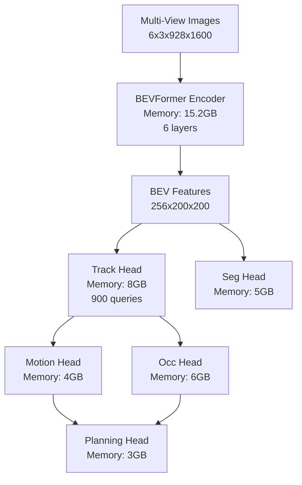
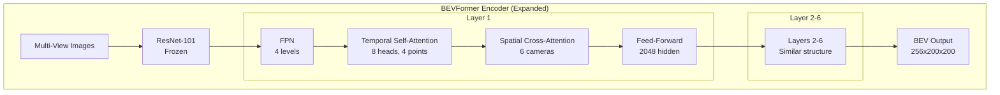
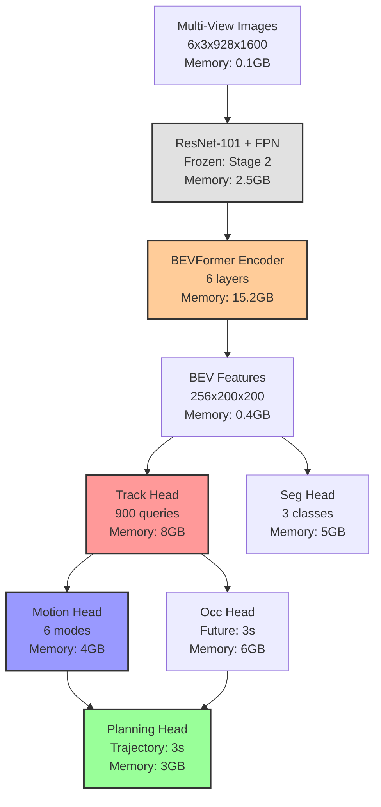
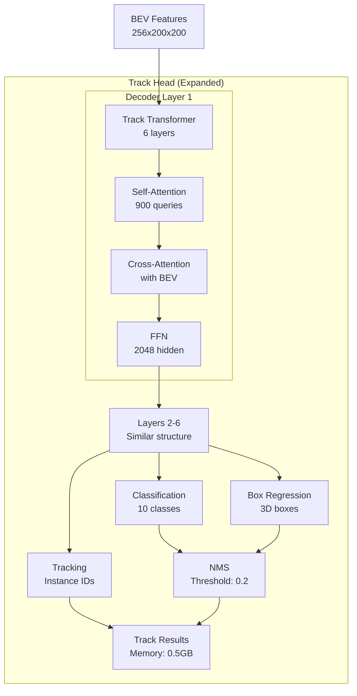
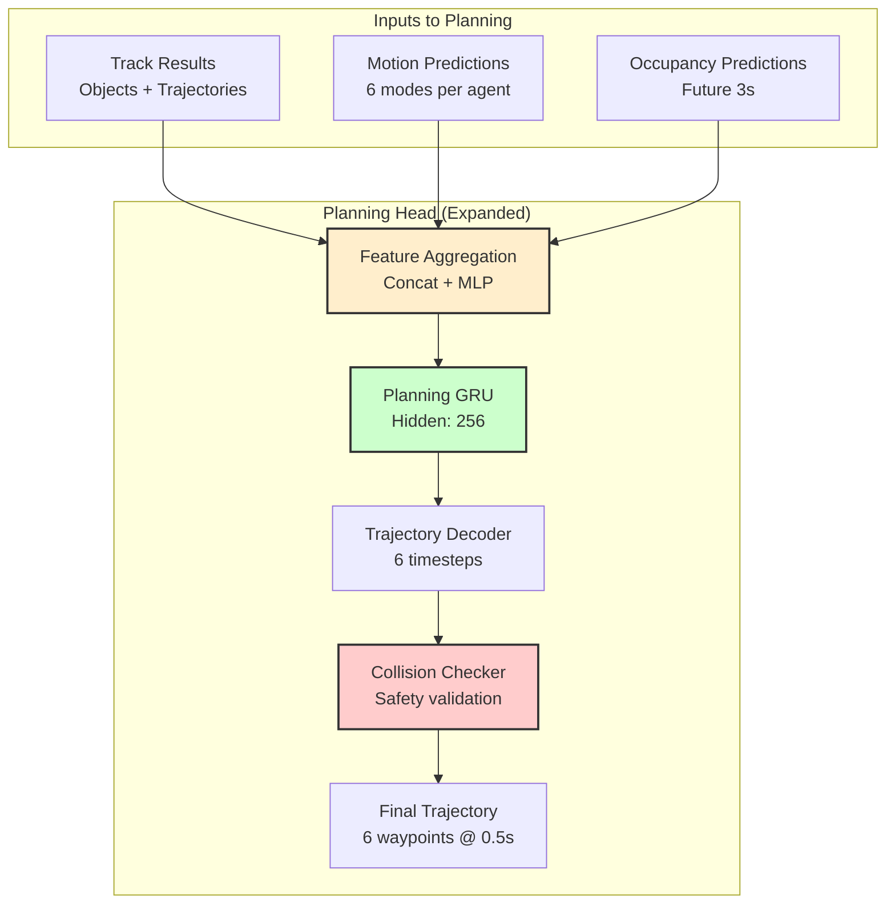

# PyTorch Operation Tracer and Visualizer for UniAD

This document outlines the architecture design for a script that traces PyTorch operations, records tensor shapes, and visualizes the dataflow using Mermaid diagrams, with specific enhancements for the UniAD multi-task autonomous driving framework.

## 1. Overview

The PyTorch Operation Tracer is designed to help developers understand the flow of tensors through neural network models, with specialized support for UniAD's hierarchical multi-task architecture:

1. Tracing all PyTorch operations during model execution
2. Recording input and output tensor shapes for each operation
3. Visualizing the dataflow as a Mermaid diagram with task-specific views
4. Providing detailed analysis of the model's computational graph
5. **UniAD-specific**: Tracking multi-head interactions, temporal queues, and BEV feature flow
6. **Memory profiling**: Essential for UniAD's 30-50GB GPU memory requirements

## 2. Architecture Components

### 2.1 Core Components

The system consists of the following core components:

1. **OperationTracer**: Hooks into PyTorch modules to trace operations
2. **TensorShapeRecorder**: Records shapes of input/output tensors
3. **DataflowVisualizer**: Generates Mermaid diagrams from trace data
4. **TraceAnalyzer**: Analyzes the trace data for insights
5. **CommandLineInterface**: Provides a user-friendly interface

#### UniAD-Specific Components:

6. **MultiHeadTracer**: Traces UniAD's five task heads (track, seg, motion, occ, planning) and their interactions
7. **TemporalTracer**: Handles temporal queue operations (3-5 frames)
8. **BEVFeatureTracer**: Specialized for BEV encoder/decoder transformations
9. **MemoryProfiler**: Tracks GPU memory usage patterns (critical for 30-50GB requirements)
10. **TaskDependencyAnalyzer**: Analyzes dependencies between task heads

### 2.2 Component Interactions

```
┌─────────────────┐     ┌───────────────────┐     ┌─────────────────────┐
│ CommandLineUI   │────▶│ OperationTracer   │────▶│ TensorShapeRecorder │
└─────────────────┘     └───────────────────┘     └─────────────────────┘
                                 │                            │
                                 ├──────────┐                 │
                                 ▼          ▼                 ▼
                         ┌─────────────┐ ┌──────────────┐ ┌───────────────┐
                         │MultiHeadTrace│ │TemporalTrace │ │ Trace Data    │
                         └─────────────┘ └──────────────┘ └───────────────┘
                                 │          │                 │
                                 ▼          ▼                 ▼
                         ┌───────────────┐ ┌──────────────┐ ┌──────────────┐
                         │ TraceAnalyzer │ │MemoryProfile│ │BEVFeatureTrace│
                         └───────────────┘ └──────────────┘ └──────────────┘
                                 │                            ▲
                                 ▼                            │
                        ┌────────────────┐                    │
                        │ DataflowVisual │────────────────────┘
                        └────────────────┘
```

## 3. Detailed Component Design

### 3.1 OperationTracer

The OperationTracer uses PyTorch hooks to intercept forward and backward passes through the model:

- **Module Hooks**: Register hooks on PyTorch modules
- **Function Hooks**: Register hooks on PyTorch autograd functions
- **Tensor Hooks**: Track tensor operations

Key features:
- Track execution order of operations
- Identify connections between operations
- Support for custom filtering of operations

```python
class OperationTracer:
    def __init__(self, model, trace_backward=False, filter_ops=None,
                 stage=2, task_heads=None):
        # Initialize tracer with UniAD-specific options
        self.stage = stage  # Stage 1 or 2
        self.task_heads = task_heads or ['track', 'seg', 'motion', 'occ', 'planning']

    def register_hooks(self):
        # Register hooks on model modules

    def trace(self, inputs):
        # Perform tracing with given inputs

    def get_trace_data(self):
        # Return collected trace data with task head annotations
```

### 3.2 TensorShapeRecorder

Records the shapes of tensors at each operation:

- Input tensor shapes
- Output tensor shapes
- Parameter shapes

Handles various tensor containers (lists, tuples, dictionaries).

#### Enhanced Data Structure for UniAD:

```python
from dataclasses import dataclass
from typing import List, Tuple, Optional

@dataclass
class TraceNode:
    # Basic information
    operation: str
    module_path: str
    input_shapes: List[Tuple]
    output_shapes: List[Tuple]

    # UniAD-specific fields
    task_head: Optional[str] = None  # track/seg/motion/occ/planning
    temporal_index: Optional[int] = None  # frame index in queue
    is_frozen: bool = False  # for frozen BEV encoder in stage 2

    # Performance metrics
    memory_usage: float = 0.0  # MB
    compute_time: float = 0.0  # ms
    flops: Optional[int] = None

    # BEV-specific
    is_bev_operation: bool = False
    bev_grid_size: Optional[Tuple[int, int]] = None

    # Dependencies
    depends_on: List[str] = field(default_factory=list)
    feeds_into: List[str] = field(default_factory=list)
```

### 3.3 DataflowVisualizer

Generates visualizations from the trace data:

- **Mermaid Diagram Generator**: Creates Mermaid syntax for dataflow
- **Graph Simplification**: Simplifies complex graphs for readability
- **Hierarchical Grouping**: Groups operations by module hierarchy
- **Module Expansion**: Default top-level view with expandable modules

Features:
- Customizable node appearance
- Filtering options for large models
- Support for exporting to various formats
- **Hierarchical visualization with module expansion**
- **Interactive drill-down into specific modules**

#### 3.3.1 Hierarchical Visualization

The visualizer supports two modes:

1. **Top-Level View (Default)**: Shows only the high-level modules and their connections
2. **Expanded Module View**: Shows detailed operations within a specific module

```python
class DataflowVisualizer:
    def __init__(self, trace_data, visualization_mode='top-level', 
                 expand_modules=None):
        """
        Args:
            trace_data: Collected trace data
            visualization_mode: 'top-level' or 'expanded'
            expand_modules: List of module names to expand (e.g., ['BEVFormer', 'TrackHead'])
        """
        self.trace_data = trace_data
        self.visualization_mode = visualization_mode
        self.expand_modules = expand_modules or []
        
    def generate_mermaid(self):
        if self.visualization_mode == 'top-level':
            return self._generate_top_level_view()
        else:
            return self._generate_expanded_view()
    
    def _generate_top_level_view(self):
        """
        Generate a high-level view showing only major modules:
        - BEVFormer Encoder
        - Task Heads (Track, Seg, Motion, Occ, Planning)
        - Major connections between modules
        """
        # Group operations by top-level module
        # Show aggregated information (total memory, FLOPs, etc.)
        pass
    
    def _generate_expanded_view(self):
        """
        Generate detailed view for specified modules:
        - All operations within the module
        - Detailed tensor shapes
        - Memory usage per operation
        """
        # Expand specified modules while keeping others collapsed
        pass
```

#### 3.3.2 Module Expansion Examples

**Top-Level View (Default)**:


**Expanded BEVFormer View**:


### 3.4 TraceAnalyzer

Analyzes the trace data to provide insights:

- Memory usage estimation
- Computational complexity analysis
- Bottleneck identification
- Layer-wise timing analysis

### 3.5 CommandLineInterface

Provides a user-friendly interface:

```
python tools/analysis_tools/trace_pytorch_ops.py \
    --config CONFIG_PATH \
    --checkpoint CHECKPOINT_PATH \
    --input-shape 1,3,224,224 \
    --output mermaid_diagram.md
```

Options:
- Model configuration
- Input specifications
- Visualization options
- Analysis preferences
- **Module expansion controls**

#### 3.5.1 Visualization Options

```bash
# Default top-level view
python tools/analysis_tools/trace_pytorch_ops.py \
    --config CONFIG_PATH \
    --checkpoint CHECKPOINT_PATH \
    --visualization-mode top-level \
    --output top_level_view.md

# Expand specific modules
python tools/analysis_tools/trace_pytorch_ops.py \
    --config CONFIG_PATH \
    --checkpoint CHECKPOINT_PATH \
    --visualization-mode expanded \
    --expand-modules BEVFormer,TrackHead \
    --output expanded_view.md

# Show all details (full expansion)
python tools/analysis_tools/trace_pytorch_ops.py \
    --config CONFIG_PATH \
    --checkpoint CHECKPOINT_PATH \
    --visualization-mode full \
    --output full_details.md
```

#### 3.5.2 Module Selection Patterns

```bash
# Expand by module type
--expand-modules "*Head"  # All task heads
--expand-modules "BEV*"   # All BEV-related modules

# Expand by specific names
--expand-modules "BEVFormer,MotionHead,PlanningHead"

# Expand by depth level
--expand-depth 2  # Show 2 levels deep from top

# Memory-based expansion
--expand-heavy-modules  # Auto-expand modules using >1GB memory
```

### 3.6 UniAD-Specific Components

#### 3.6.1 MultiHeadTracer

Traces interactions between UniAD's five task heads:

```python
class MultiHeadTracer:
    def __init__(self, task_heads=['track', 'seg', 'motion', 'occ', 'planning']):
        self.task_heads = task_heads
        self.head_dependencies = {
            'motion': ['track'],
            'occ': ['track'],
            'planning': ['track', 'motion', 'occ']
        }

    def trace_task_heads(self, model):
        # Track data flow between task heads
        # Identify inter-head dependencies
        pass
```

#### 3.6.2 TemporalTracer

Handles temporal queue operations for multi-frame processing:

```python
class TemporalTracer:
    def __init__(self, queue_length=3):
        self.queue_length = queue_length

    def trace_temporal_flow(self, bev_features):
        # Track how features aggregate over frames
        # Visualize temporal fusion operations
        pass
```

#### 3.6.3 BEVFeatureTracer

Specialized tracer for BEV transformations:

```python
class BEVFeatureTracer:
    def __init__(self):
        self.bev_shape = (200, 200)  # BEV grid size
        self.feature_dim = 256

    def trace_bev_operations(self, encoder, decoder):
        # Track BEV encoder operations
        # Monitor feature propagation through decoder
        # Identify frozen vs trainable components
        pass
```

#### 3.6.4 MemoryProfiler

Profile GPU memory usage:

```python
class MemoryProfiler:
    def __init__(self, stage=2):
        self.stage = stage
        self.expected_usage = {1: 30000, 2: 17000}  # MB

    def profile_gpu_memory(self):
        # Track memory allocation per operation
        # Identify memory bottlenecks
        # Compare against expected usage
        pass
```

## 4. Implementation Plan

### 4.1 Phase 1: Core Tracing with UniAD Awareness

1. Implement basic module hooks with task head detection
2. Record tensor shapes with BEV grid awareness
3. Track execution order and task dependencies
4. Add stage-specific tracing (Stage 1 vs Stage 2)

### 4.2 Phase 2: Temporal and Multi-Head Support

1. Implement temporal queue tracing
2. Add multi-head interaction tracking
3. Visualize task hierarchy (perception → prediction → planning)
4. Track frozen vs trainable components

### 4.3 Phase 3: Memory Profiling and Optimization

1. Implement GPU memory profiling
2. Identify memory bottlenecks (critical for 30-50GB usage)
3. Add memory-efficient tracing modes
4. Compare memory usage between stages

### 4.4 Phase 4: Advanced Visualization

1. Generate task-aware Mermaid diagrams
2. Add temporal dimension visualization
3. Create memory heatmaps
4. Implement hierarchical task views

### 4.5 Phase 5: Analysis and Optimization

1. Task dependency analysis
2. Performance bottleneck identification
3. Stage comparison tools
4. Optimization recommendations

## 5. Usage Examples

### 5.1 Basic Usage

```bash
# Trace UniAD Stage 1 (perception only)
python tools/analysis_tools/trace_pytorch_ops.py \
    --config projects/configs/stage1_track_map/base_track_map.py \
    --checkpoint ckpts/uniad_base_track_map.pth \
    --stage 1

# Trace UniAD Stage 2 (end-to-end)
python tools/analysis_tools/trace_pytorch_ops.py \
    --config projects/configs/stage2_e2e/base_e2e.py \
    --checkpoint ckpts/uniad_base_e2e.pth \
    --stage 2
```

### 5.2 Advanced Usage

```bash
# Trace specific task heads with memory profiling
python tools/analysis_tools/trace_pytorch_ops.py \
    --config projects/configs/stage2_e2e/base_e2e.py \
    --checkpoint ckpts/uniad_base_e2e.pth \
    --task-heads track,motion,planning \
    --temporal-frames 3 \
    --memory-profile \
    --output uniad_trace_analysis.md

# Focus on BEV operations
python tools/analysis_tools/trace_pytorch_ops.py \
    --config projects/configs/stage2_e2e/base_e2e.py \
    --checkpoint ckpts/uniad_base_e2e.pth \
    --bev-focus \
    --filter-ops BEVFormer,BEVEncoder,BEVDecoder \
    --visualize-temporal \
    --output bev_flow.md

# Compare Stage 1 and Stage 2
python tools/analysis_tools/trace_pytorch_ops.py \
    --compare-stages \
    --stage1-config projects/configs/stage1_track_map/base_track_map.py \
    --stage1-ckpt ckpts/uniad_base_track_map.pth \
    --stage2-config projects/configs/stage2_e2e/base_e2e.py \
    --stage2-ckpt ckpts/uniad_base_e2e.pth \
    --output stage_comparison.md
```

## 6. Challenges and Considerations

### 6.1 Performance Impact

- Tracing adds overhead to model execution
- Memory usage can be significant for large models

### 6.2 Complex Models

- Handling recurrent connections
- Dealing with dynamic control flow
- Supporting custom PyTorch extensions

### 6.3 Visualization Complexity

- Large models produce complex diagrams
- Need effective simplification strategies
- Balance between detail and readability

### 6.4 UniAD-Specific Challenges

- **Memory Management**: Handling 30-50GB GPU memory requirements
- **Temporal Complexity**: Visualizing multi-frame aggregation
- **Task Dependencies**: Tracking complex inter-head dependencies
- **Stage Differences**: Different architectures between Stage 1 and 2

## 7. Sample Visualization Output

### 7.1 Top-Level View (Default)



### 7.2 Expanded Track Head View



### 7.3 Expanded Planning Head View



### 7.4 Memory-Based Auto-Expansion View

```mermaid
graph TB
    %% Auto-expanded view showing modules >5GB memory
    Input[Input] --> Backbone[Backbone<br/>2.5GB]
    
    Backbone --> BEVEncoder
    
    subgraph "BEVFormer Encoder (15.2GB) - Expanded"
        BEVEncoder[BEVFormer Entry] --> TSA[Temporal Self-Attn<br/>6 layers<br/>Memory: 7GB]
        TSA --> SCA[Spatial Cross-Attn<br/>6 layers<br/>Memory: 8.2GB]
    end
    
    SCA --> BEVFeatures[BEV Features]
    
    subgraph "Track Head (8GB) - Expanded"
        BEVFeatures --> TrackDec[Track Decoder<br/>Memory: 5GB]
        TrackDec --> TrackPost[Post-processing<br/>Memory: 3GB]
    end
    
    TrackPost --> SmallModules[Other Modules<br/>(< 5GB each)]
    
    subgraph "Occ Head (6GB) - Expanded"
        BEVFeatures --> OccConv[Occ Conv Layers<br/>Memory: 4GB]
        OccConv --> OccPredict[Occ Prediction<br/>Memory: 2GB]
    end
    
    %% Collapsed modules (< 5GB)
    BEVFeatures --> SegHead[Seg Head<br/>5GB]
    SmallModules --> MotionHead[Motion Head<br/>4GB]
    SmallModules --> PlanHead[Plan Head<br/>3GB]
```

### 7.2 Memory Usage Heatmap

```
Operation               | Memory (GB) | Percentage | Visual
------------------------|-------------|------------|--------
BEV Encoder            | 15.2        | 30.4%      | ████████████████████████████████░░░░░░░░
Track Head             | 8.0         | 16.0%      | ████████████████░░░░░░░░░░░░░░░░░░░░░░░░
Temporal Aggregation   | 7.5         | 15.0%      | ███████████████░░░░░░░░░░░░░░░░░░░░░░░░░
Seg Head               | 5.0         | 10.0%      | ██████████░░░░░░░░░░░░░░░░░░░░░░░░░░░░░░
Occ Head               | 6.0         | 12.0%      | ████████████░░░░░░░░░░░░░░░░░░░░░░░░░░░░
Motion Head            | 4.0         | 8.0%       | ████████░░░░░░░░░░░░░░░░░░░░░░░░░░░░░░░░
Planning Head          | 3.0         | 6.0%       | ██████░░░░░░░░░░░░░░░░░░░░░░░░░░░░░░░░░░
Others                 | 1.3         | 2.6%       | ███░░░░░░░░░░░░░░░░░░░░░░░░░░░░░░░░░░░░░
Total                  | 50.0        | 100%       | ████████████████████████████████████████
```

## 8. Implementation Details for Hierarchical Visualization

### 8.1 Module Hierarchy Detection

```python
class ModuleHierarchyAnalyzer:
    def __init__(self, model):
        self.model = model
        self.module_tree = self._build_module_tree()
        
    def _build_module_tree(self):
        """Build hierarchical tree of modules"""
        tree = {}
        for name, module in self.model.named_modules():
            parts = name.split('.')
            current = tree
            for part in parts:
                if part not in current:
                    current[part] = {'_module': None, '_children': {}}
                current = current[part]['_children']
        return tree
    
    def get_top_level_modules(self):
        """Return list of top-level module names"""
        return list(self.module_tree.keys())
    
    def get_module_info(self, module_name):
        """Get aggregated info for a module"""
        total_memory = 0
        total_flops = 0
        num_operations = 0
        # Aggregate from all child operations
        return {
            'memory': total_memory,
            'flops': total_flops,
            'operations': num_operations,
            'has_children': bool(children)
        }
```

### 8.2 Visualization State Management

```python
class VisualizationState:
    def __init__(self):
        self.expanded_modules = set()
        self.visualization_mode = 'top-level'
        self.depth_limit = None
        self.memory_threshold = None
        
    def should_expand_module(self, module_name, module_info):
        """Determine if a module should be expanded"""
        if self.visualization_mode == 'full':
            return True
        elif self.visualization_mode == 'top-level':
            return False
        elif module_name in self.expanded_modules:
            return True
        elif self.memory_threshold and module_info['memory'] > self.memory_threshold:
            return True
        return False
```

### 8.3 Interactive Features (Future)

```javascript
// Planned interactive features for web-based visualization
class InteractiveMermaidDiagram {
    constructor(diagramData) {
        this.data = diagramData;
        this.expandedModules = new Set();
    }
    
    onModuleClick(moduleId) {
        if (this.expandedModules.has(moduleId)) {
            this.collapseModule(moduleId);
        } else {
            this.expandModule(moduleId);
        }
        this.rerender();
    }
    
    expandModule(moduleId) {
        // Fetch detailed operations for this module
        // Update diagram with expanded view
    }
    
    collapseModule(moduleId) {
        // Show only aggregated info
        // Update diagram with collapsed view
    }
}
```

## 9. Future Extensions

- Integration with profiling tools (PyTorch Profiler, NVIDIA Nsight)
- Support for distributed training analysis
- **Interactive web-based visualization with clickable module expansion**
- Real-time tracing during training
- Automatic optimization suggestions based on bottlenecks
- Integration with TensorBoard for comprehensive analysis
- Support for custom UniAD variants and configurations
- **Export to interactive HTML with D3.js visualization**
- **Module search and filtering capabilities**
- **Diff visualization between model versions**
