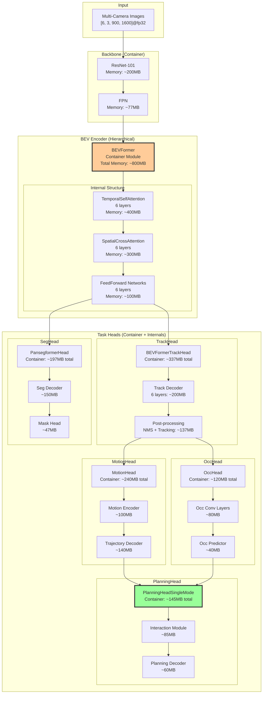

# UniAD Architecture Analysis - Detailed Reference

This document provides a detailed architectural reference for UniAD (Unified Autonomous Driving), complementing the individual component reports. For the main index of all reports, see [README.md](README.md).

## Architecture Overview

### Core Architecture Components (Hierarchical View)



### Module Dependencies and Data Flow

1. **Perception Layer** (Stage 1)
   - Track Head: Detects and tracks 3D objects
   - Segmentation Head: BEV semantic segmentation
   - Both operate directly on BEV features

2. **Prediction Layer** 
   - Motion Head: Predicts future trajectories using track outputs
   - Occupancy Head: Predicts future occupancy using track outputs
   - Dependencies: Track Head outputs

3. **Planning Layer**
   - Planning Head: Generates ego trajectory
   - Dependencies: Motion predictions, occupancy predictions, track features

## Key Architectural Insights

### 1. Hierarchical Task Design
UniAD follows a planning-oriented philosophy where tasks are hierarchically structured:
```
Perception (Track + Map) → Prediction (Motion + Occ) → Planning
```

### 2. Two-Stage Training Strategy
- **Stage 1**: Train perception modules (track + map) with full BEV encoder
- **Stage 2**: Freeze BEV encoder and train all modules end-to-end

### 3. Memory Optimization
- Stage 1: ~50GB GPU memory with FP32 (can reduce to ~30GB with queue_length=3)
- Stage 2: ~17GB GPU memory (BEV encoder frozen)
- Mixed Precision: Additional 40-50% memory reduction possible with FP16/BF16

### 4. Unified BEV Representation
- 200×200 BEV grid at 0.512m resolution
- 256-dimensional features (typically FP32, can be FP16)
- Temporal aggregation over multiple frames
- BEV features: [1, 256, 200, 200] @ ~39MB (FP32) or ~20MB (FP16)

### 5. Multi-Task Learning
Balanced loss weights across all tasks:
- Track: 1.0
- Map: 1.0
- Motion: 1.0
- Occupancy: 1.0
- Planning: 1.0

## Performance Benchmarks

### Stage 1 (Perception)
- **Tracking**: AMOTA ~0.390
- **Mapping**: High-quality BEV segmentation

### Stage 2 (End-to-End)
- **Motion**: ~0.705 minADE
- **Occupancy**: ~63.7% IoU
- **Planning**: ~0.29% avg collision rate

## Data Type Optimization

### Mixed Precision Training
UniAD can benefit significantly from mixed precision training:

| Component | Default (FP32) | Mixed Precision | Memory Savings |
|-----------|---------------|-----------------|----------------|
| Image Backbone | ~277MB | ~139MB (FP16) | 50% |
| BEV Encoder | ~800MB | ~400MB (FP16) | 50% |
| Task Heads | ~240MB | ~240MB (FP32) | 0% (accuracy) |
| **Total Stage 1** | ~1,317MB | ~779MB | 41% |

### Recommended Configuration
```python
mixed_precision = {
    'backbone': 'float16',     # ResNet-101 in FP16
    'bev_encoder': 'float16',  # BEVFormer in FP16
    'task_heads': 'float32',   # Maintain FP32 for accuracy
    'loss_scale': 'dynamic'    # Automatic loss scaling
}
```

### Data Type Conversions
- Input images: FP32 → FP16 after initial preprocessing
- BEV features: FP16 throughout encoder
- Task outputs: FP16 → FP32 for final predictions

## Technical Requirements

### Dependencies
- PyTorch 1.9.1 (with AMP support for mixed precision)
- CUDA 11.1
- mmcv-full 1.4.0
- mmdet 2.14.0
- mmdet3d 0.17.1

### Hardware
- Minimum 8x V100 GPUs for training (Tensor Core support recommended)
- 32GB+ GPU memory recommended (16GB possible with mixed precision)
- A100/H100 GPUs: Additional BFloat16 support

## Detailed Component Analysis

### Task Head Communication Protocol

```python
# Data flow between task heads
track_outputs = {
    "bev_embed": bev_features,              # [1, 256, 200, 200]@fp32
    "track_scores": detection_scores,        # [300]@fp32
    "track_bbox_results": bounding_boxes,    # [300, 10]@fp32
    "track_query_embeddings": track_queries, # [300, 256]@fp32
    "sdc_embedding": ego_vehicle_embedding,  # [1, 256]@fp32
}

motion_outputs = {
    "trajectory_predictions": pred_trajs,     # [N, 6, 12, 2]@fp32
    "trajectory_scores": pred_scores,         # [N, 6]@fp32
    "agent_features": motion_features,        # [N, 256]@fp32
    "sdc_traj_query": ego_motion_query,      # [1, 256]@fp32
}

occupancy_outputs = {
    "occ": future_occupancy_masks,           # [B, T, 1, H, W]@fp32
    "occ_prob": occupancy_probabilities,     # [B, T, 1, H, W]@fp32
    "flow": motion_flow_field,               # [B, T, 2, H, W]@fp32
}
```

### Memory Optimization Strategies

#### Stage-Specific Optimizations

**Stage 1 (Perception Training)**:
- Full BEV encoder gradients: ~50GB memory
- Optimization: Reduce queue_length from 5 to 3
- Result: Memory usage drops to ~30GB

**Stage 2 (End-to-End Training)**:
- Frozen BEV encoder: No gradient storage
- Memory usage: ~17GB (65% reduction)
- All task heads active with balanced losses

#### Mixed Precision Implementation

```python
# Component-specific precision settings
component_precision = {
    # Image processing
    'image_backbone': {
        'compute': 'float16',
        'master_weights': 'float32',
        'memory_reduction': '50%'
    },
    
    # BEV transformation
    'bev_encoder': {
        'spatial_attention': 'float16',
        'temporal_attention': 'float16',
        'output': 'float16',
        'memory_reduction': '50%'
    },
    
    # Task heads (maintain accuracy)
    'track_head': {
        'decoder': 'float16',
        'output': 'float32',
        'memory_reduction': '46%'
    },
    
    'planning_head': {
        'interaction': 'float16',
        'trajectory': 'float32',  # Safety critical
        'memory_reduction': '21%'
    }
}
```

### Temporal Processing Analysis

UniAD processes temporal information at multiple levels:

1. **BEV Encoder**: 3-5 frame history for temporal consistency
2. **Track Head**: Memory bank with 4-frame sliding window
3. **Motion Head**: 4-frame velocity estimation
4. **Planning Head**: 6-step future trajectory (3 seconds)

### Critical Design Decisions

1. **Unified BEV Space**: All tasks operate in same 200×200 grid
2. **Hierarchical Dependencies**: Enforces planning-oriented philosophy
3. **Frozen Encoder Training**: Enables larger batch sizes in Stage 2
4. **Memory Bank Design**: Balances tracking accuracy with memory efficiency
5. **Mixed Precision Safety**: Critical components remain in FP32

---

*For the complete index of all reports, see [README.md](README.md). This document focuses on architectural details and cross-component interactions.*