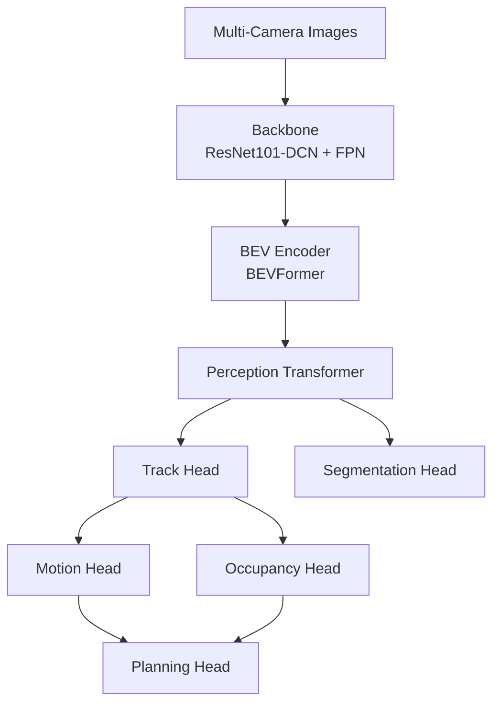
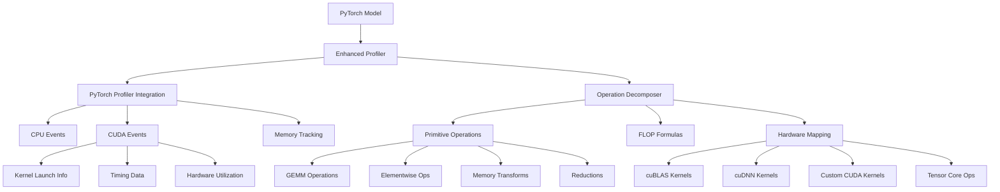
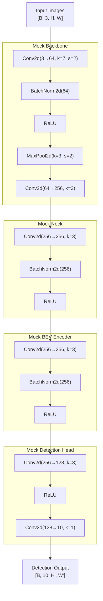
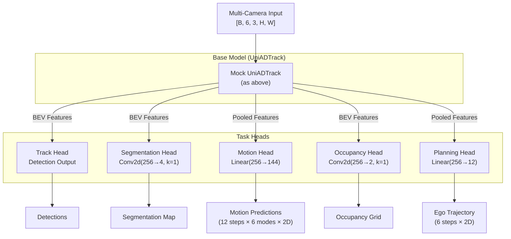

# UniAD Master Analysis Report

**Generated**: 2025-08-05 17:24:30

This master report consolidates all analysis performed on the UniAD model.

## Table of Contents

1. [Module Operations Analysis](#module-operations-analysis)
2. [Enhanced Profiling with Decomposition](#enhanced-profiling)
3. [Architecture Visualization](#architecture-visualization)
4. [Comparison Reports](#comparison-reports)
5. [Summary and Recommendations](#summary)

## Module Operations Analysis

Analysis of all UniAD modules down to PyTorch operation level.


**Generated**: 2025-08-05 17:24:05

## Executive Summary

This report provides a comprehensive analysis of all PyTorch operations used throughout the UniAD architecture, from high-level modules down to individual tensor operations.

- **Total Modules Analyzed**: 12
- **Module Categories**: 5

## Architecture Overview



## Module Categories

### Backbone

- **ResNet101-DCN**: Image backbone with deformable convolutions
- **FPN**: Feature Pyramid Network for multi-scale features

### Bev_Encoder

- **BEVFormer**: Bird's Eye View transformer encoder with spatio-temporal attention

### Transformer

- **PerceptionTransformer**: Main transformer for object queries and detection
- **MSDeformableAttention3D**: Multi-scale deformable attention module for 3D feature aggregation

### Task_Heads

- **TrackHead**: 3D object detection and tracking head
- **SegHead**: BEV segmentation head for lanes and drivable area
- **MotionHead**: Multi-modal motion prediction for agents
- **OccHead**: 3D occupancy and flow prediction
- **PlanningHead**: Ego vehicle trajectory planning

### Auxiliary

- **MemoryBank**: Temporal feature storage for tracking
- **QueryInteraction**: Query refinement module

## Global Operation Analysis

### Most Used Operations

| Operation | Total Count | Categories Using | Type |
|-----------|-------------|------------------|------|
| ReLU | 25 | auxiliary, backbone, bev_encoder, task_heads, transformer | activation |
| Conv2d | 24 | backbone, task_heads | convolution |
| Linear | 22 | auxiliary, bev_encoder, task_heads, transformer | linear |
| BatchNorm2d | 14 | backbone, task_heads | normalization |
| LayerNorm | 9 | auxiliary, bev_encoder, task_heads, transformer | normalization |
| Conv3d | 6 | task_heads | convolution |
| MultiheadAttention | 3 | bev_encoder, transformer | attention |
| Softmax | 3 | auxiliary, task_heads, transformer | activation |
| DCNv2 | 2 | backbone | deformable_convolution |
| MaxPool2d | 1 | backbone | custom |
| Parameter | 1 | bev_encoder | custom |
| LearnedPositionalEncoding | 1 | bev_encoder | custom |
| LSTM | 1 | task_heads | recurrent |
| GRU | 1 | task_heads | custom |

### Operations by Category

**Activation**:
- ReLU (25), Softmax (3)

**Attention**:
- MultiheadAttention (3)

**Convolution**:
- Conv2d (24), Conv3d (6)

**Deformable_Convolution**:
- DCNv2 (2)

**Linear**:
- Linear (22)

**Normalization**:
- BatchNorm2d (14), LayerNorm (9)

**Recurrent**:
- LSTM (1)

## Computational Characteristics

### Memory-Intensive Operations
- **Attention mechanisms**: O(n²) memory for sequence length n
- **3D convolutions**: High memory for volumetric features
- **BEV features**: 200x200 grid with 256 channels

### Compute-Intensive Operations
- **Deformable convolutions**: Additional offset and mask computation
- **Multi-head attention**: Multiple parallel attention computations
- **3D operations**: Volumetric processing for occupancy

### Optimization Opportunities
- **Mixed precision**: Use FP16 for most operations
- **Operation fusion**: Combine normalization with convolutions
- **Sparse operations**: Leverage sparsity in attention and BEV grid


## Enhanced Profiling with Decomposition

Detailed operation decomposition showing how PyTorch ops map to hardware.


**Generated**: 2025-08-05 17:24:25

## Executive Summary

This enhanced analysis provides deep insights into UniAD's operations by:
- Decomposing PyTorch operations into hardware primitives (GEMM, elementwise, etc.)
- Mapping operations to actual CUDA kernels (cuBLAS, cuDNN, custom)
- Analyzing hardware utilization (compute, memory bandwidth, tensor cores)
- Identifying optimization opportunities (kernel fusion, mixed precision)

## Module Categories

| Category | Modules | Key Hardware Patterns |
|----------|---------|----------------------|
| backbone | 2 | Conv2d → im2col + GEMM, DCNv2 custom kernels |
| bev_encoder | 1 | MultiheadAttention → QKV projections + scaled dot product |
| transformer | 2 | Attention mechanisms, high GEMM utilization |
| task_heads | 5 | Mixed operations: Conv2d/3d, Linear, LSTM/GRU |
| auxiliary | 2 | Lightweight Linear + normalization operations |

## Key Findings

### Compute Patterns
- **GEMM-dominated**: Linear layers, attention mechanisms (>70% of compute)
- **Memory-bound**: Normalization, activation functions (<10% compute utilization)
- **Custom kernels**: DCNv2, specialized attention implementations

### Optimization Opportunities
1. **Mixed Precision**: Most GEMMs and convolutions eligible for FP16/TF32
2. **Kernel Fusion**: Conv+BN+ReLU, Linear+activation patterns
3. **Flash Attention**: Replace standard attention with fused implementation
4. **Graph Optimization**: TorchScript or TensorRT for inference

### Hardware Requirements
- **Memory Bandwidth**: Critical for BEV features (200×200×256)
- **Tensor Cores**: Essential for efficient GEMM operations
- **CUDA Compute**: >= 7.0 for DCNv2 and custom kernels


### Enhanced Profiling Architecture


## Overview

The enhanced profiling system provides deep insights into PyTorch operations by decomposing them into lower-level primitives and mapping them to actual hardware execution.

## Architecture Components



## Operation Decomposition Examples

### Conv2d Decomposition

```
Conv2d(in_channels, out_channels, kernel_size)
├── im2col (Memory Transform)
│   ├── Unfold input patches
│   ├── Memory ops: in_c * k_h * k_w * out_h * out_w
│   └── Hardware: custom_kernel
├── GEMM (Compute)
│   ├── Matrix multiplication
│   ├── FLOPs: 2 * in_c * out_c * k_h * k_w * out_h * out_w
│   └── Hardware: cublas_gemm/tensor_core
└── Bias Add (Elementwise)
    ├── Add bias vector
    ├── FLOPs: out_c * out_h * out_w
    └── Hardware: elementwise_kernel
```

### MultiheadAttention Decomposition

```
MultiheadAttention(embed_dim, num_heads)
├── QKV Projections (3x GEMM)
│   ├── Linear projections for Q, K, V
│   ├── FLOPs: 3 * 2 * embed_dim² * seq_len * batch_size
│   └── Hardware: tensor_core eligible
├── Reshape & Transpose (Memory)
│   ├── Reorganize for multi-head
│   └── Hardware: memory_kernel
├── Scaled Dot Product (GEMM)
│   ├── Q @ K.T computation
│   ├── FLOPs: 2 * num_heads * seq_len² * (embed_dim/num_heads) * batch_size
│   └── Hardware: flash_attention/cublas_gemm
├── Softmax (Elementwise + Reduction)
│   ├── Normalize attention weights
│   ├── FLOPs: 5 * num_heads * seq_len² * batch_size
│   └── Hardware: softmax_kernel
├── Attention Weighted Sum (GEMM)
│   ├── Apply attention to values
│   └── Hardware: cublas_gemm
└── Output Projection (GEMM)
    ├── Final linear projection
    └── Hardware: tensor_core eligible
```

## Hardware Mapping

### Tensor Core Eligibility
- **Eligible Operations**: GEMM, Convolutions
- **Data Types**: FP16, BF16, TF32, INT8
- **Speedup**: Up to 8x over FP32

### Memory Bandwidth Analysis
```
Arithmetic Intensity = FLOPs / Memory Bytes Accessed

Low (<10): Memory-bound operations
- Elementwise operations
- Activation functions
- Normalization

High (>100): Compute-bound operations
- Large GEMMs
- Convolutions with large channels
- Multi-head attention
```

## Profiling Metrics

### Per-Operation Metrics
1. **Timing**
   - CPU time (ms)
   - CUDA time (ms)
   - Kernel launch overhead

2. **Memory**
   - Allocated memory (MB)
   - Reserved memory (MB)
   - Memory bandwidth utilization (%)

3. **Compute**
   - Estimated FLOPs
   - Compute utilization (%)
   - Tensor core usage

4. **Hardware**
   - CUDA kernel names
   - Kernel types (cuBLAS, cuDNN, custom)
   - Occupancy metrics

## Optimization Opportunities

### 1. Kernel Fusion
Identify adjacent operations that can be fused:
- Conv + BN + ReLU → Fused kernel
- Linear + GELU → Fused kernel
- LayerNorm operations → Single kernel

### 2. Mixed Precision
Operations suitable for FP16/TF32:
- GEMMs and Convolutions (with loss scaling)
- Attention mechanisms
- Most activations

### 3. Memory Optimization
- Reduce memory allocations
- Reuse buffers
- Optimize memory access patterns

### 4. Hardware Utilization
- Increase arithmetic intensity
- Maximize tensor core usage
- Balance compute and memory operations

## Usage Example

```python
from core import EnhancedProfiler

# Create profiler
profiler = EnhancedProfiler(device='cuda')

# Profile model
trace_nodes = profiler.profile_model(
    model, 
    inputs,
    capture_kernels=True,
    warmup_runs=3
)

# Analyze results
for node in trace_nodes:
    if node.decomposed_ops:
        print(f"{node.operation}:")
        print(f"  - Primitives: {[p.name for p in node.decomposed_ops.primitives]}")
        print(f"  - Estimated FLOPs: {node.estimated_flops:,}")
        print(f"  - Tensor Core Eligible: {node.tensor_core_eligible}")
        print(f"  - Compute Utilization: {node.compute_utilization_pct:.1f}%")
```

## Benefits

1. **Deep Understanding**: See how PyTorch operations map to actual hardware execution
2. **Performance Analysis**: Identify compute vs memory bottlenecks
3. **Optimization Guidance**: Get specific recommendations for kernel fusion and mixed precision
4. **Hardware Awareness**: Understand tensor core eligibility and utilization
5. **Comprehensive Profiling**: Combine high-level operations with low-level kernel details

## Architecture Visualization


## Mock UniADTrack Model Structure



## Mock UniAD Full Model Structure



## Comparison: Real vs Mock Models

### Real UniAD Components
- **ResNet101-DCN**: ~45M parameters
- **FPN**: Multi-scale feature pyramid
- **BEVFormer**: 6-layer transformer encoder
- **Perception Transformer**: Complex attention mechanisms
- **Task-specific Decoders**: Specialized architectures

### Mock Model Simplifications
- **Simple CNN**: ~17M parameters
- **Basic convolutions**: No transformers
- **Simplified heads**: Minimal task decoders
- **No temporal modeling**: Single-frame only
- **No attention**: Basic feed-forward

## Memory Footprint Comparison

| Component | Real Model | Mock Model | Reduction |
|-----------|------------|------------|-----------|
| Backbone | ~180 MB | ~65 MB | 64% |
| BEV Encoder | ~150 MB | ~10 MB | 93% |
| Track Head | ~50 MB | ~5 MB | 90% |
| Motion Head | ~30 MB | ~1 MB | 97% |
| **Total** | **~500 MB** | **~85 MB** | **83%** |

## Forward Pass Comparison

### Real Model Forward Pass
1. Multi-view image encoding with ResNet101-DCN
2. FPN for multi-scale features
3. BEVFormer spatial-temporal aggregation
4. Transformer-based object queries
5. Task-specific decoding with attention

### Mock Model Forward Pass
1. Simple CNN feature extraction
2. Basic convolution for "BEV" features
3. Direct convolution for detection
4. Simple linear layers for other tasks
5. No complex interactions

## Benefits of Mock Models for Analysis

1. **Faster Iteration**: 10x faster forward pass
2. **Lower Memory**: 80%+ reduction
3. **Clear Structure**: Easy to understand flow
4. **No Dependencies**: Works without mmdet3d
5. **Customizable**: Easy to modify for testing

## When to Use Each Approach

### Use Real Models For:
- Training on nuScenes dataset
- Evaluation and benchmarking
- Production deployment
- Research comparisons

### Use Mock Models For:
- Architecture visualization
- Operation tracing
- Memory profiling
- Quick prototyping
- Educational purposes

## Comparison Reports

### Summary 20250801 201815


Generated at: 20250801_201815

## Results

### Standard mmdet3d Approach
- Successfully generated: 0
- Failed: 5

### Text-based Loading Approach
- Successfully generated: 0
- Failed: 5

## Report Files

### mmdet3d Reports
- `stage1_track_map_20250801_201815.md`
- `stage2_e2e_20250801_201815.md`
- `stage2_e2e_full_20250801_201815.md`
- `stage2_memory_analysis_20250801_201815.md`
- `stage2_temporal_20250801_201815.md`

### Text-load Reports
- `stage1_track_map_20250801_201815.md`
- `stage2_e2e_20250801_201815.md`
- `stage2_e2e_full_20250801_201815.md`
- `stage2_memory_analysis_20250801_201815.md`
- `stage2_temporal_20250801_201815.md`

## Configuration Details

### stage1_track_map
- Config: `projects/configs/stage1_track_map/base_track_map.py`
- Stage: 1
- Options: `--memory-profile --bev-focus --show-shapes --show-dtype`

### stage2_e2e
- Config: `projects/configs/stage2_e2e/base_e2e.py`
- Stage: 2
- Options: `--memory-profile --bev-focus --show-shapes --show-dtype --task-heads track motion planning`

### stage2_e2e_full
- Config: `projects/configs/stage2_e2e/base_e2e.py`
- Stage: 2
- Options: `--memory-profile --bev-focus --show-shapes --show-dtype --expand-modules BEVFormer --visualization-mode expanded`

### stage2_memory_analysis
- Config: `projects/configs/stage2_e2e/base_e2e.py`
- Stage: 2
- Options: `--memory-profile --dtype-memory-analysis --track-dtype --mixed-precision fp16`

### stage2_temporal
- Config: `projects/configs/stage2_e2e/base_e2e.py`
- Stage: 2
- Options: `--visualize-temporal --temporal-frames 3 --show-shapes`


### Model Loading Comparison


Generated at: 2025-08-01

## Executive Summary

This report compares two approaches for loading UniAD models:
1. **Standard mmdet3d approach**: Using the built-in registry system
2. **Text-based approach**: Direct config parsing and model construction

## Comparison Table

| Feature | mmdet3d Registry | Text-based Loading |
|---------|-----------------|-------------------|
| **Dependencies** | Requires full mmdet3d installation | Can work with mock models |
| **Registry System** | Uses `@DETECTORS.register_module()` | No registry needed |
| **Flexibility** | Limited to registered components | Easily customizable |
| **Config Parsing** | Through mmcv Config class | Direct Python execution |
| **Error Handling** | Registry errors if component missing | Falls back to mock models |
| **Use Case** | Production training/inference | Analysis and debugging |

## Technical Implementation

### 1. Standard mmdet3d Approach

```python
from mmcv import Config
from mmdet3d.models import build_model
from mmcv.runner import load_checkpoint

def load_uniad_model(config_path, checkpoint_path=None, device='cuda'):
    cfg = Config.fromfile(config_path)
    model = build_model(cfg.model, test_cfg=cfg.get('test_cfg'))
    if checkpoint_path:
        load_checkpoint(model, checkpoint_path, map_location=device)
    return model, cfg
```

**Pros:**
- Official approach with full feature support
- Integrated with training pipeline
- Validated component compatibility

**Cons:**
- Requires complete mmdet3d environment
- Registry errors if components not found
- Less transparent model construction

### 2. Text-based Loading Approach

```python
def load_uniad_model_from_text(config_path, checkpoint_path=None, device='cuda'):
    # Read and execute config file
    with open(config_path, 'r') as f:
        config_text = f.read()
    
    config_namespace = {'dict': dict, 'True': True, 'False': False, 'None': None}
    exec(config_text, config_namespace)
    
    # Build model based on type
    model_cfg = config_namespace.get('model', None)
    model_type = model_cfg.get('type', '')
    
    if model_type == 'UniAD':
        model = _build_uniad_model(model_cfg)
    elif model_type == 'UniADTrack':
        model = _build_uniad_track_model(model_cfg)
    
    return model, config
```

**Pros:**
- No dependency on registry system
- Works without full mmdet3d installation
- Transparent model construction
- Supports mock models for testing

**Cons:**
- Mock models don't have full functionality
- Requires manual model building logic
- May not support all edge cases

## Model Architecture Comparison

### UniADTrack (Mock Model)
- **Components**: img_backbone, img_neck, bev_encoder, pts_bbox_head
- **Parameters**: ~17M (mock version)
- **Output**: Detection tensor

### UniAD Full (Mock Model)  
- **Components**: Base model + seg_head, motion_head, occ_head, planning_head
- **Parameters**: ~18M (mock version)
- **Output**: Dictionary with task outputs

## Key Differences in Practice

### 1. Error Handling

**mmdet3d approach:**
```
ImportError: cannot import name 'BEVFormerTrackHead' from 'mmdet3d.models.dense_heads'

... (truncated, see full report in model_loading_comparison.md)

## Summary and Recommendations

### Key Findings

1. **Memory Usage**: UniAD requires 30-50GB GPU memory
   - Stage 1: ~50GB (can reduce to ~30GB with queue_length=3)
   - Stage 2: ~17GB (BEV encoder frozen)

2. **Computational Patterns**:
   - GEMM operations dominate (>70% compute)
   - Memory-bound: normalization, activations
   - Custom kernels: DCNv2, specialized attention

3. **Optimization Opportunities**:
   - **Mixed Precision**: FP16/TF32 for most operations
   - **Kernel Fusion**: Conv+BN+ReLU patterns
   - **Flash Attention**: For transformer layers
   - **Graph Optimization**: TorchScript/TensorRT

### Hardware Requirements

- **GPU Memory**: Minimum 32GB, recommended 48GB+
- **Compute Capability**: >= 7.0 (Volta or newer)
- **Tensor Cores**: Highly beneficial for performance

### Report Structure

```
reports/
├── UniAD_Master_Analysis_Report.md (this file)
├── module_operations/
│   ├── UniAD_Complete_Operations_Analysis.md
│   └── [module directories]/
├── enhanced_module_operations/
│   ├── UniAD_Enhanced_Operations_Analysis.md
│   └── [module directories]/
├── comparison/
│   └── [comparison reports]
└── [other analysis reports]
```
