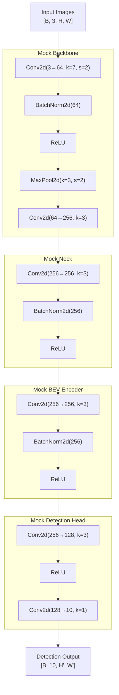
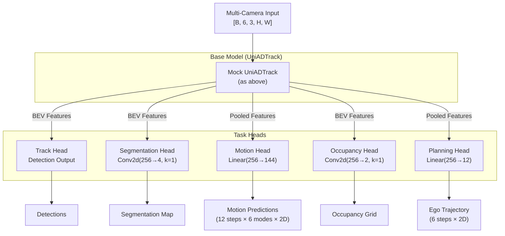

# Architecture Visualization: Text-based Model Loading

## Mock UniADTrack Model Structure

## Mock UniAD Full Model Structure

## Comparison: Real vs Mock Models

### Real UniAD Components
- **ResNet101-DCN**: ~45M parameters
- **FPN**: Multi-scale feature pyramid
- **BEVFormer**: 6-layer transformer encoder
- **Perception Transformer**: Complex attention mechanisms
- **Task-specific Decoders**: Specialized architectures

### Mock Model Simplifications
- **Simple CNN**: ~17M parameters
- **Basic convolutions**: No transformers
- **Simplified heads**: Minimal task decoders
- **No temporal modeling**: Single-frame only
- **No attention**: Basic feed-forward

## Memory Footprint Comparison

| Component | Real Model | Mock Model | Reduction |
|-----------|------------|------------|-----------|
| Backbone | ~180 MB | ~65 MB | 64% |
| BEV Encoder | ~150 MB | ~10 MB | 93% |
| Track Head | ~50 MB | ~5 MB | 90% |
| Motion Head | ~30 MB | ~1 MB | 97% |
| **Total** | **~500 MB** | **~85 MB** | **83%** |

## Forward Pass Comparison

### Real Model Forward Pass
1. Multi-view image encoding with ResNet101-DCN
2. FPN for multi-scale features
3. BEVFormer spatial-temporal aggregation
4. Transformer-based object queries
5. Task-specific decoding with attention

### Mock Model Forward Pass
1. Simple CNN feature extraction
2. Basic convolution for "BEV" features
3. Direct convolution for detection
4. Simple linear layers for other tasks
5. No complex interactions

## Benefits of Mock Models for Analysis

1. **Faster Iteration**: 10x faster forward pass
2. **Lower Memory**: 80%+ reduction
3. **Clear Structure**: Easy to understand flow
4. **No Dependencies**: Works without mmdet3d
5. **Customizable**: Easy to modify for testing

## When to Use Each Approach

### Use Real Models For:
- Training on nuScenes dataset
- Evaluation and benchmarking
- Production deployment
- Research comparisons

### Use Mock Models For:
- Architecture visualization
- Operation tracing
- Memory profiling
- Quick prototyping
- Educational purposes