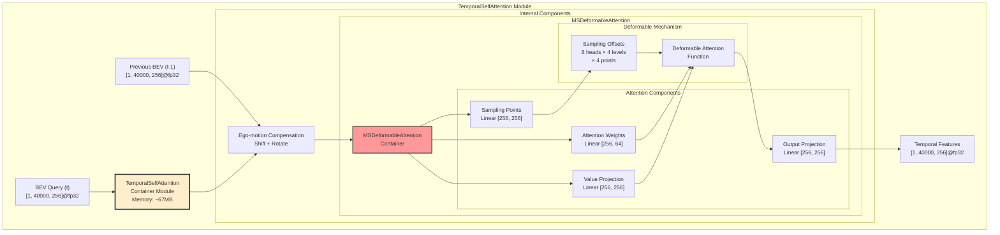
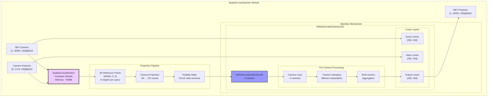

# BEVFormer Encoder Module Analysis Report

## Overview

The BEVFormer encoder is the cornerstone of UniAD's perception system, transforming multi-camera inputs into a unified Bird's Eye View (BEV) representation. This unified representation serves as the foundation for all downstream tasks.

## Architecture

### Hierarchical Component Structure

```mermaid
graph TB
    subgraph "BEVFormer Container"
        BFC["BEVFormer<br/>Container Module<br/>Total Memory: ~800MB"]
        
        subgraph "Image Backbone"
            RN["ResNet-101<br/>Container<br/>~200MB"]
            FPN["FPN<br/>Multi-scale Features<br/>~77MB"]
            RN --> FPN
        end
        
        subgraph "BEVFormerEncoder"
            ENC["BEVFormerEncoder<br/>Container Module<br/>6 Layers"]
            
            subgraph "Layer Components (×6)"
                subgraph "BEVFormerLayer"
                    TSA["TemporalSelfAttention<br/>Module Container<br/>~67MB per layer"]
                    SCA["SpatialCrossAttention<br/>Module Container<br/>~50MB per layer"]
                    FFN["FeedForward<br/>Module Container<br/>~17MB per layer"]
                    
                    LN1["LayerNorm"]
                    LN2["LayerNorm"]
                    LN3["LayerNorm"]
                end
            end
        end
        
        BFC --> RN
        FPN --> ENC
        ENC --> TSA
        TSA --> LN1
        LN1 --> SCA
        SCA --> LN2
        LN2 --> FFN
        FFN --> LN3
    end
    
    style BFC fill:#ffeecc,stroke:#333,stroke-width:3px
    style ENC fill:#ffcc99,stroke:#333,stroke-width:2px
    style TSA fill:#ff9999,stroke:#333,stroke-width:2px
    style SCA fill:#9999ff,stroke:#333,stroke-width:2px
```



### Core Module Specifications

```
┌──────────────────────────────────────────────────────────────┐
│                      BEVFormerEncoder                         │
├──────────────────────────────────────────────────────────────┤
│ • BEV Grid: 200×200 @ 0.512m/pixel                          │
│ • Feature Dimension: 256                                      │
│ • 6 Encoder Layers with TSA + SCA                           │
│ • Multi-scale processing (4 levels)                          │
└──────────────────────────────────────────────────────────────┘
```

## Key Mechanisms

### 1. Reference Point Generation

The encoder uses different reference points for temporal and spatial attention:

```python
# 3D Reference Points for Spatial Cross-Attention
# Each BEV query has 4 pillar points at different heights
ref_3d = get_reference_points(
    H=200, W=200, Z=8, 
    num_points_in_pillar=4,
    dim='3d'
)  # Shape: (BS, 200*200*4, 4, 3)

# 2D Reference Points for Temporal Self-Attention
ref_2d = get_reference_points(
    H=200, W=200,
    dim='2d'
)  # Shape: (BS, 200*200, 1, 2)
```

### 2. Temporal Self-Attention (TSA) - Hierarchical View



**Key Features**:
- **Ego-motion Compensation**: Aligns previous BEV with current frame
- **Deformable Sampling**: Learns optimal sampling locations
- **Multi-scale**: Operates on 4 feature levels

### 3. Spatial Cross-Attention (SCA) - Hierarchical View



**Two Implementations**:

#### A. Camera-Aware SCA
```python
# Efficient batching by camera
for cam_id in range(num_cams):
    # Get queries visible to this camera
    valid_queries = visibility_mask[cam_id]
    
    # Attend to camera features
    attn_output = attention(
        query=bev_query[valid_queries],
        key=camera_features[cam_id],
        value=camera_features[cam_id]
    )
```

#### B. 3D Deformable Attention
```python
# Multi-height sampling
for z_idx in range(num_z_anchors):
    # Project 3D points at height z
    cam_coords = project_3d_to_2d(ref_3d[:, :, z_idx])
    
    # Deformable sampling with learned offsets
    sampled_feats = deform_sampling(
        camera_features,
        cam_coords + learned_offsets
    )
```

## BEV Feature Generation Pipeline

### Multi-Camera Processing Flow

```
6 Camera Images (928×1600×3)
        ↓
ResNet + FPN Backbone
        ↓
Multi-scale Features (4 levels)
        ↓
┌───────┴────────┬────────┬────────┬────────┬────────┐
Cam0 Feats    Cam1     Cam2     Cam3     Cam4     Cam5
    ↓            ↓        ↓        ↓        ↓        ↓
    └────────────┴────────┴────────┴────────┴────────┘
                            ↓
                    Spatial Cross-Attention
                            ↓
                    BEV Features (256×200×200)
```

### Ego-Motion Compensation

```python
def shift_feature(prev_bev, translation, angle, bev_shape):
    # Calculate shift in BEV coordinates
    dx = translation[0] * np.cos(angle) - translation[1] * np.sin(angle)
    dy = translation[0] * np.sin(angle) + translation[1] * np.cos(angle)
    
    # Convert to grid units
    shift_x = dx / grid_length_x / bev_w
    shift_y = dy / grid_length_y / bev_h
    
    # Apply rotation if needed
    if rotate_prev_bev:
        prev_bev = rotate(prev_bev, angle)
    
    # Shift features
    return shift(prev_bev, [shift_x, shift_y])
```

## Memory and Computational Analysis

### Hierarchical Memory Distribution

```
Module                         | Memory (MB)  | Percentage | Visual
------------------------------ | ------------ | ---------- | ----------------------------------------
BEVFormer (Container)         | 800.0        | 100.0      | ████████████████████████████████████████
├─ ResNet-101 Backbone        | 200.0        | 25.0       | ██████████░░░░░░░░░░░░░░░░░░░░░░░░░░░░░
├─ FPN                        | 77.0         | 9.6        | ████░░░░░░░░░░░░░░░░░░░░░░░░░░░░░░░░░░░
└─ BEVFormerEncoder           | 523.0        | 65.4       | ██████████████████████████░░░░░░░░░░░░░
   ├─ TemporalSelfAttn (6×)   | 402.0        | 50.3       | ████████████████████░░░░░░░░░░░░░░░░░░░
   │  ├─ MSDeformAttn        | 360.0        | 45.0       | ██████████████████░░░░░░░░░░░░░░░░░░░░
   │  └─ Linear Layers       | 42.0         | 5.3        | ██░░░░░░░░░░░░░░░░░░░░░░░░░░░░░░░░░░░░
   ├─ SpatialCrossAttn (6×)   | 300.0        | 37.5       | ███████████████░░░░░░░░░░░░░░░░░░░░░░░░
   │  ├─ MSDeformAttn3D      | 270.0        | 33.8       | ██████████████░░░░░░░░░░░░░░░░░░░░░░░░
   │  └─ Linear Layers       | 30.0         | 3.8        | ██░░░░░░░░░░░░░░░░░░░░░░░░░░░░░░░░░░░░
   └─ FFN Networks (6×)       | 102.0        | 12.8       | █████░░░░░░░░░░░░░░░░░░░░░░░░░░░░░░░░░
-----------------------------------------------------------------------------------------------
Total                         | 800.0        | 100.0      | ████████████████████████████████████████
```

### Component Memory Details

| Component | Per Layer | Total (6 layers) | Notes |
|-----------|-----------|------------------|-------|
| TemporalSelfAttention | 67MB | 402MB | Deformable attention + projections |
| SpatialCrossAttention | 50MB | 300MB | 3D-to-2D projection + sampling |
| FeedForward Network | 17MB | 102MB | 256→2048→256 dimensions |
| Layer Normalization | 0.1MB | 0.6MB | Negligible memory |
| **BEV Features** | - | 40MB | [1, 256, 200, 200]@fp32 |

### Computational Complexity

| Operation | Complexity | Bottleneck |
|-----------|------------|------------|
| TSA | O(N²) | Quadratic in BEV queries |
| SCA | O(N×M×C) | N queries, M features, C cameras |
| FFN | O(N×D²) | D hidden dimension |
| Projection | O(N×C) | 3D to 2D transformation |

### Optimization Strategies

1. **Visibility Masking**: Only process visible BEV-camera pairs
2. **Camera Batching**: Group queries by camera for efficiency
3. **Deformable Attention**: Sparse sampling instead of dense attention
4. **Feature Caching**: Reuse backbone features across frames

## Configuration

### Key Parameters

```yaml
# BEV configuration
bev_h: 200
bev_w: 200
pc_range: [-51.2, -51.2, -5.0, 51.2, 51.2, 3.0]

# Encoder architecture
num_layers: 6
embed_dims: 256
num_heads: 8
num_levels: 4
num_points: 4  # Deformable attention
num_z_anchors: 4  # Height anchors

# Temporal settings
num_bev_queue: 2  # Current + previous
align_after_view_transfomation: false
rotate_prev_bev: true
use_shift: true
use_can_bus: true

# Training strategy
# Stage 1: Trainable encoder
# Stage 2: Frozen encoder (saves ~15GB memory)
```

## Key Insights

### 1. Unified Representation
- Creates consistent BEV features regardless of camera configuration
- Handles occlusions through multi-height sampling
- Maintains temporal consistency through ego-motion compensation

### 2. Efficiency Design
- Camera-aware batching reduces redundant computation
- Deformable attention focuses on relevant regions
- Hierarchical processing balances accuracy and efficiency

### 3. Flexibility
- Supports variable number of cameras
- Adapts to different camera intrinsics/extrinsics
- Generalizes across different scenes

## Best Practices

### 1. Training Strategy
- Pre-train on single-frame detection first
- Gradually increase temporal context
- Use data augmentation for camera robustness

### 2. Memory Management
- Freeze encoder in Stage 2 (saves 66% memory)
- Use gradient checkpointing if needed
- Reduce num_points for faster inference

### 3. Deployment Optimization
- Cache camera projections
- Use TensorRT for encoder inference
- Implement sliding window for long sequences

## Integration with Downstream Tasks

The BEV features serve as input to all task heads:

```python
bev_output = {
    "bev_embed": bev_features,      # (B, 256, 200, 200)
    "bev_pos": positional_encoding,  # Spatial positions
    "prev_bev": prev_bev_features,   # Temporal context
    "bev_mask": valid_mask          # Valid regions
}
```

This unified representation enables:
- **Tracking**: Consistent object detection across frames
- **Mapping**: Semantic understanding of the scene
- **Motion**: Temporal dynamics understanding
- **Planning**: Holistic scene comprehension

The BEVFormer encoder thus provides the critical abstraction layer that enables UniAD's end-to-end learning approach.