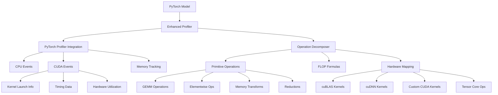

# Enhanced PyTorch Operation Profiling Architecture

## Overview

The enhanced profiling system provides deep insights into PyTorch operations by decomposing them into lower-level primitives and mapping them to actual hardware execution.

## Architecture Components



## Operation Decomposition Examples

### Conv2d Decomposition

```
Conv2d(in_channels, out_channels, kernel_size)
├── im2col (Memory Transform)
│   ├── Unfold input patches
│   ├── Memory ops: in_c * k_h * k_w * out_h * out_w
│   └── Hardware: custom_kernel
├── GEMM (Compute)
│   ├── Matrix multiplication
│   ├── FLOPs: 2 * in_c * out_c * k_h * k_w * out_h * out_w
│   └── Hardware: cublas_gemm/tensor_core
└── Bias Add (Elementwise)
    ├── Add bias vector
    ├── FLOPs: out_c * out_h * out_w
    └── Hardware: elementwise_kernel
```

### MultiheadAttention Decomposition

```
MultiheadAttention(embed_dim, num_heads)
├── QKV Projections (3x GEMM)
│   ├── Linear projections for Q, K, V
│   ├── FLOPs: 3 * 2 * embed_dim² * seq_len * batch_size
│   └── Hardware: tensor_core eligible
├── Reshape & Transpose (Memory)
│   ├── Reorganize for multi-head
│   └── Hardware: memory_kernel
├── Scaled Dot Product (GEMM)
│   ├── Q @ K.T computation
│   ├── FLOPs: 2 * num_heads * seq_len² * (embed_dim/num_heads) * batch_size
│   └── Hardware: flash_attention/cublas_gemm
├── Softmax (Elementwise + Reduction)
│   ├── Normalize attention weights
│   ├── FLOPs: 5 * num_heads * seq_len² * batch_size
│   └── Hardware: softmax_kernel
├── Attention Weighted Sum (GEMM)
│   ├── Apply attention to values
│   └── Hardware: cublas_gemm
└── Output Projection (GEMM)
    ├── Final linear projection
    └── Hardware: tensor_core eligible
```

## Hardware Mapping

### Tensor Core Eligibility
- **Eligible Operations**: GEMM, Convolutions
- **Data Types**: FP16, BF16, TF32, INT8
- **Speedup**: Up to 8x over FP32

### Memory Bandwidth Analysis
```
Arithmetic Intensity = FLOPs / Memory Bytes Accessed

Low (<10): Memory-bound operations
- Elementwise operations
- Activation functions
- Normalization

High (>100): Compute-bound operations
- Large GEMMs
- Convolutions with large channels
- Multi-head attention
```

## Profiling Metrics

### Per-Operation Metrics
1. **Timing**
   - CPU time (ms)
   - CUDA time (ms)
   - Kernel launch overhead

2. **Memory**
   - Allocated memory (MB)
   - Reserved memory (MB)
   - Memory bandwidth utilization (%)

3. **Compute**
   - Estimated FLOPs
   - Compute utilization (%)
   - Tensor core usage

4. **Hardware**
   - CUDA kernel names
   - Kernel types (cuBLAS, cuDNN, custom)
   - Occupancy metrics

## Optimization Opportunities

### 1. Kernel Fusion
Identify adjacent operations that can be fused:
- Conv + BN + ReLU → Fused kernel
- Linear + GELU → Fused kernel
- LayerNorm operations → Single kernel

### 2. Mixed Precision
Operations suitable for FP16/TF32:
- GEMMs and Convolutions (with loss scaling)
- Attention mechanisms
- Most activations

### 3. Memory Optimization
- Reduce memory allocations
- Reuse buffers
- Optimize memory access patterns

### 4. Hardware Utilization
- Increase arithmetic intensity
- Maximize tensor core usage
- Balance compute and memory operations

## Usage Example

```python
from core import EnhancedProfiler

# Create profiler
profiler = EnhancedProfiler(device='cuda')

# Profile model
trace_nodes = profiler.profile_model(
    model, 
    inputs,
    capture_kernels=True,
    warmup_runs=3
)

# Analyze results
for node in trace_nodes:
    if node.decomposed_ops:
        print(f"{node.operation}:")
        print(f"  - Primitives: {[p.name for p in node.decomposed_ops.primitives]}")
        print(f"  - Estimated FLOPs: {node.estimated_flops:,}")
        print(f"  - Tensor Core Eligible: {node.tensor_core_eligible}")
        print(f"  - Compute Utilization: {node.compute_utilization_pct:.1f}%")
```

## Benefits

1. **Deep Understanding**: See how PyTorch operations map to actual hardware execution
2. **Performance Analysis**: Identify compute vs memory bottlenecks
3. **Optimization Guidance**: Get specific recommendations for kernel fusion and mixed precision
4. **Hardware Awareness**: Understand tensor core eligibility and utilization
5. **Comprehensive Profiling**: Combine high-level operations with low-level kernel details