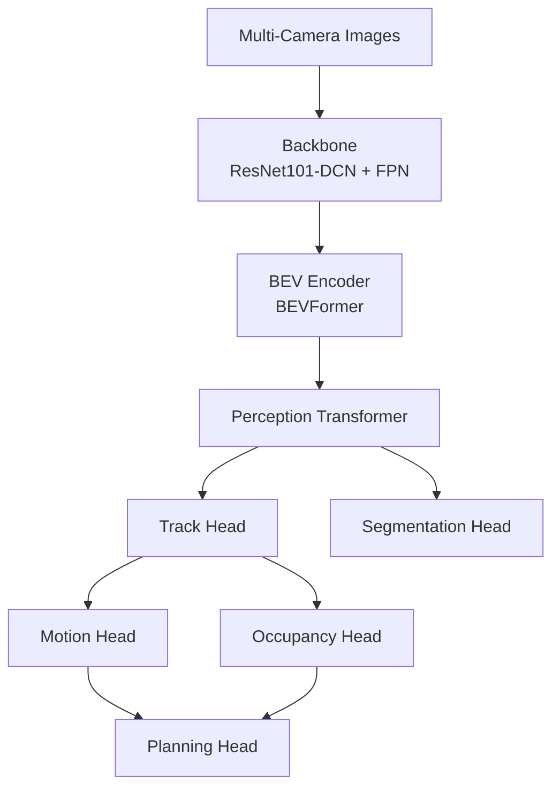

# UniAD Complete Operations Analysis

**Generated**: 2025-08-05 17:24:05

## Executive Summary

This report provides a comprehensive analysis of all PyTorch operations used throughout the UniAD architecture, from high-level modules down to individual tensor operations.

- **Total Modules Analyzed**: 12
- **Module Categories**: 5

## Architecture Overview

## Module Categories

### Backbone

- **ResNet101-DCN**: Image backbone with deformable convolutions
- **FPN**: Feature Pyramid Network for multi-scale features

### Bev_Encoder

- **BEVFormer**: Bird's Eye View transformer encoder with spatio-temporal attention

### Transformer

- **PerceptionTransformer**: Main transformer for object queries and detection
- **MSDeformableAttention3D**: Multi-scale deformable attention module for 3D feature aggregation

### Task_Heads

- **TrackHead**: 3D object detection and tracking head
- **SegHead**: BEV segmentation head for lanes and drivable area
- **MotionHead**: Multi-modal motion prediction for agents
- **OccHead**: 3D occupancy and flow prediction
- **PlanningHead**: Ego vehicle trajectory planning

### Auxiliary

- **MemoryBank**: Temporal feature storage for tracking
- **QueryInteraction**: Query refinement module

## Global Operation Analysis

### Most Used Operations

| Operation | Total Count | Categories Using | Type |
|-----------|-------------|------------------|------|
| ReLU | 25 | auxiliary, backbone, bev_encoder, task_heads, transformer | activation |
| Conv2d | 24 | backbone, task_heads | convolution |
| Linear | 22 | auxiliary, bev_encoder, task_heads, transformer | linear |
| BatchNorm2d | 14 | backbone, task_heads | normalization |
| LayerNorm | 9 | auxiliary, bev_encoder, task_heads, transformer | normalization |
| Conv3d | 6 | task_heads | convolution |
| MultiheadAttention | 3 | bev_encoder, transformer | attention |
| Softmax | 3 | auxiliary, task_heads, transformer | activation |
| DCNv2 | 2 | backbone | deformable_convolution |
| MaxPool2d | 1 | backbone | custom |
| Parameter | 1 | bev_encoder | custom |
| LearnedPositionalEncoding | 1 | bev_encoder | custom |
| LSTM | 1 | task_heads | recurrent |
| GRU | 1 | task_heads | custom |

### Operations by Category

**Activation**:
- ReLU (25), Softmax (3)

**Attention**:
- MultiheadAttention (3)

**Convolution**:
- Conv2d (24), Conv3d (6)

**Deformable_Convolution**:
- DCNv2 (2)

**Linear**:
- Linear (22)

**Normalization**:
- BatchNorm2d (14), LayerNorm (9)

**Recurrent**:
- LSTM (1)

## Computational Characteristics

### Memory-Intensive Operations
- **Attention mechanisms**: O(n²) memory for sequence length n
- **3D convolutions**: High memory for volumetric features
- **BEV features**: 200x200 grid with 256 channels

### Compute-Intensive Operations
- **Deformable convolutions**: Additional offset and mask computation
- **Multi-head attention**: Multiple parallel attention computations
- **3D operations**: Volumetric processing for occupancy

### Optimization Opportunities
- **Mixed precision**: Use FP16 for most operations
- **Operation fusion**: Combine normalization with convolutions
- **Sparse operations**: Leverage sparsity in attention and BEV grid
