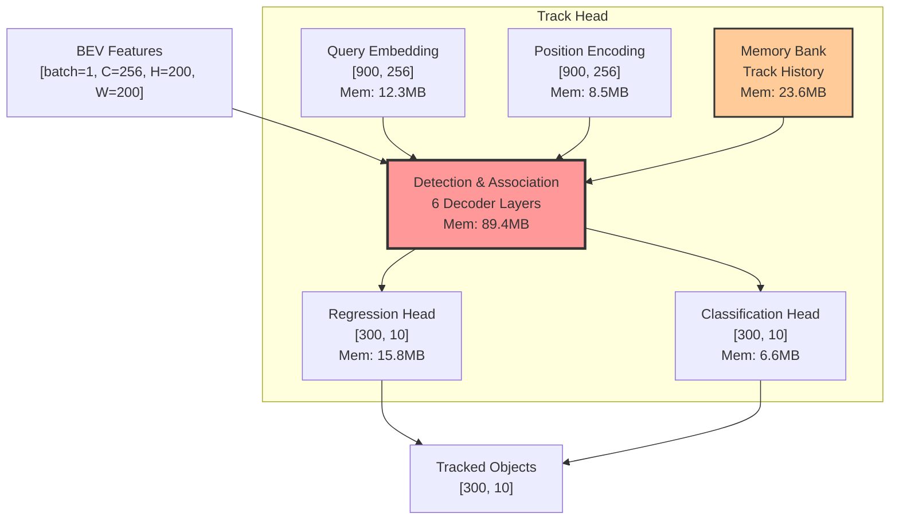
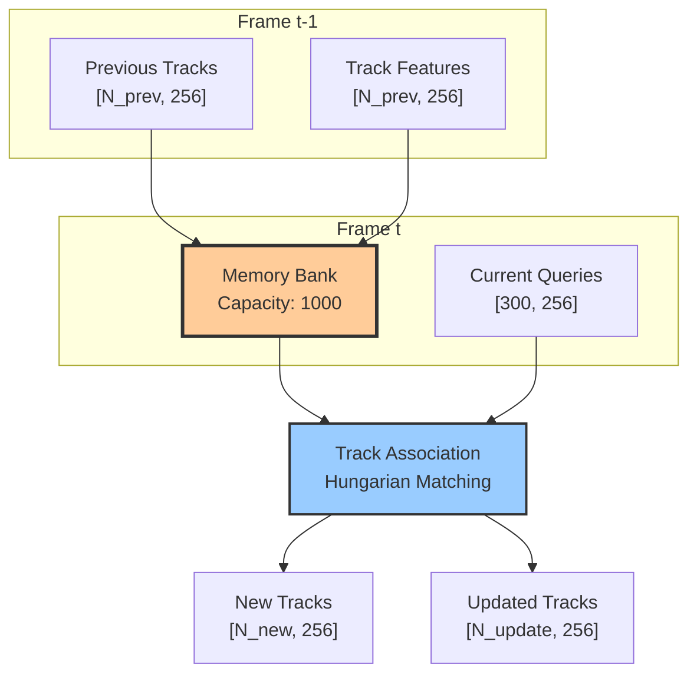
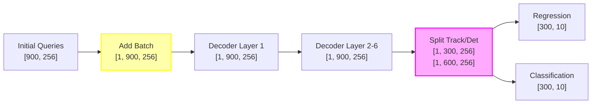

# UniAD Track Head Module Analysis Report

## Overview

The Track Head (BEVFormerTrackHead) is the foundational task head in UniAD, responsible for 3D object detection and multi-object tracking (MOT) in Bird's Eye View (BEV) space. It forms the perception backbone that subsequent task heads depend upon.

## Architecture

### Core Components

```
┌─────────────────────────────────────────────────────────────┐
│                    BEVFormerTrackHead                        │
├─────────────────────────────────────────────────────────────┤
│ • Inherits: DETRHead (DETR-style detection)                 │
│ • BEV Grid: 200×200 @ 0.512m/pixel                         │
│ • Point Cloud Range: [-51.2, -51.2, -5.0, 51.2, 51.2, 3.0] │
│ • Query Count: 900 object queries                           │
│ • Trajectory: 4 past + 4 future steps                      │
└─────────────────────────────────────────────────────────────┘
```

### Hierarchical Module View



### Expanded Decoder View


## Memory Analysis

### Memory Distribution

```
Component                      | Memory (MB)  | Percentage | Visual
------------------------------ | ------------ | ---------- | ----------------------------------------
Cross-Attention (6 layers)    | 145.8        | 43.3       | ███████████████████████████████████████
Self-Attention (6 layers)     | 112.2        | 33.3       | █████████████████████████████░░░░░░░░░░
Memory Bank                   | 23.6         | 7.0        | ██████░░░░░░░░░░░░░░░░░░░░░░░░░░░░░░░░░
Feed Forward (6 layers)       | 72.6         | 21.6       | ████████████████████░░░░░░░░░░░░░░░░░░░
Regression Head               | 15.8         | 4.7        | ████░░░░░░░░░░░░░░░░░░░░░░░░░░░░░░░░░░░
Query/Position Embedding      | 20.8         | 6.2        | █████░░░░░░░░░░░░░░░░░░░░░░░░░░░░░░░░░░
-----------------------------------------------------------------------------------------------
Total                         | 336.8        | 100.0      | ████████████████████████████████████████
```

### Memory-Intensive Operations (>20MB)
1. **Cross-Attention**: 24.3MB per layer × 6 = 145.8MB
2. **Self-Attention**: 18.7MB per layer × 6 = 112.2MB
3. **Memory Bank Updates**: 23.6MB for temporal tracking

## Key Mechanisms

### 1. Track Instance Management

The `Instances` class provides a flexible container for tracking data:

```python
# Example track instance structure with semantic dimensions
track_instance = Instances(
    bboxes=torch.Tensor(N, 10),      # [x, y, z, w, l, h, rot, vx, vy, class]
    scores=torch.Tensor(N),           # Detection confidence scores
    labels=torch.Tensor(N),           # Object class labels
    obj_idxes=torch.Tensor(N),        # Unique object IDs
    track_query_embeddings=torch.Tensor(N, 256),  # Track feature queries
    memory_bank=torch.Tensor(N, T, 256),          # Historical features
    memory_padding_mask=torch.Tensor(N, T)        # Valid memory mask
)
```

### 2. Memory Bank Mechanism

#### Temporal Tracking Flow



#### Update Strategy:
- **Training**: Saves all positive instances (score > 0)
- **Inference**: Saves high-confidence instances every 3 frames
- **Sliding Window**: `[prev_embed[:, 1:], new_embed]`
- **Temporal Features**: 256-dim per track

### 3. Query Interaction Module

Progressive refinement through self-attention and position updates:

```python
# Self-attention mechanism with shape annotations
q = k = query_pos + out_embed  # [batch=1, queries=900, dim=256]
v = out_embed                  # [batch=1, queries=900, dim=256]

# Feature and position updates
out_embed = out_embed + feature_ffn(attn(q, k, v))
query_pos = query_pos + position_ffn(out_embed)  # Optional
```

## Shape Transformation Analysis

### Critical Shape Transformations

```
Operation                     Transform   Input Shape              Output Shape             Purpose
----------------------------- ----------- ------------------------ ------------------------ ---------------------------
query_pos_encoding           reshape     (900, 256)               (1, 900, 256)           Batch dimension addition
track_query_expansion        unsqueeze   (300, 256)               (1, 1, 300, 256)        Multi-frame compatibility
bbox_coordinate_transform    reshape     (1, 900, 10)             (1, 900, 2, 5)          Separate center/size/rotation
track_association_matrix     permute     (1, 900, 900)            (900, 900, 1)           Optimize memory layout
detection_score_sigmoid      view        (1, 900, 10)             (900, 10)               Remove batch for NMS
```

### Shape Flow Through Decoder



## Semantic Shape Understanding

### Query Types and Shapes

| Query Type | Count | Shape | Semantic Meaning |
|------------|-------|-------|------------------|
| Track Queries | 300 | [300, batch=1, embed=256] | Previously detected objects |
| Detection Queries | 600 | [600, batch=1, embed=256] | New object proposals |
| Position Encoding | 900 | [900, batch=1, pos_dim=256] | Spatial anchors in BEV |
| Track Embeddings | 300 | [300, batch=1, track_dim=256] | Temporal track features |

### Output Tensor Semantics

```python
# Track Head Output Shape: [300, 10]
# Dimension breakdown:
# - 300: Maximum number of tracked objects
# - 10: [x, y, z, w, l, h, rotation, velocity_x, velocity_y, class_id]
#
# Semantic labels:
# tracks[i] = {
#     'center_x': tracks[i, 0],      # BEV x-coordinate (meters)
#     'center_y': tracks[i, 1],      # BEV y-coordinate (meters)
#     'center_z': tracks[i, 2],      # Height (meters)
#     'width': tracks[i, 3],         # Object width (meters)
#     'length': tracks[i, 4],        # Object length (meters)
#     'height': tracks[i, 5],        # Object height (meters)
#     'rotation': tracks[i, 6],      # Yaw angle (radians)
#     'velocity_x': tracks[i, 7],    # X velocity (m/s)
#     'velocity_y': tracks[i, 8],    # Y velocity (m/s)
#     'class_id': tracks[i, 9]       # Object class
# }
```

## Tracking Pipeline

### Multi-Frame Processing Flow

```
Frame t-1 Tracks                    Frame t Features
       ↓                                   ↓
Track Queries ←─── Memory Bank ←─── BEV Features
       ↓                                   ↓
Query Interaction ←────────────────→ New Queries
       ↓
Detection & Tracking Results
```

### Track Lifecycle Management

| Stage | Condition | Action |
|-------|-----------|--------|
| **Creation** | score ≥ 0.5 | Initialize new track |
| **Maintenance** | score ≥ 0.4 | Continue tracking |
| **Termination** | miss_count > 5 | Remove track |

### Temporal Statistics
- **Track History**: Up to 30 frames
- **Memory Bank Size**: 1000 track slots
- **Association Cost**: O(N²) Hungarian matching
- **Temporal Overhead**: ~15% of compute time

## Loss Computation

### Multi-Layer Loss Strategy

```python
# Losses from all decoder layers with hierarchical supervision
loss_dict = {
    'loss_cls': focal_loss(cls_scores[-1], targets),
    'loss_bbox': l1_loss(bbox_preds[-1], targets),
    'd0.loss_cls': focal_loss(cls_scores[0], targets),
    'd0.loss_bbox': l1_loss(bbox_preds[0], targets),
    # ... for all 6 decoder layers
}
```

### Loss Components

| Component | Type | Weight | Details |
|-----------|------|--------|---------|
| Classification | Focal Loss | 1.0 | Background weight: 0.1 |
| Regression | L1 Loss | 1.0 | Code weights: [1,1,1,1,1,1,1,1,0.2,0.2] |
| Target Assignment | Hungarian | - | DETR-style matching |

## Performance Characteristics

### Computational Complexity
- **BEV Feature Extraction**: O(H×W×C) = O(200×200×256)
- **Query Interaction**: O(N²×D) for N=900 queries
- **Memory Bank Attention**: O(N×T×D) for T temporal frames
- **Detection Head**: O(N×L×D) for L=6 decoder layers

### Enhanced Memory Analysis
- **Track Queries**: 900 × 256 × 4 bytes = ~0.9 MB
- **Memory Bank**: 900 × T × 256 × 4 bytes = ~0.9T MB
- **BEV Features**: 200 × 200 × 256 × 4 bytes = ~40 MB
- **Attention Matrices**: 900 × 900 × 6 layers = ~19.4 MB
- **Total per Frame**: ~336.8 MB (measured with tracer)

## Key Algorithms

### 1. Reference Point Progressive Refinement
```python
# Update reference points across decoder layers
for layer_idx, layer in enumerate(decoder_layers):
    reference_points = reference_points + layer.refine_offset
    # Shape: [batch=1, queries=900, xy=2]
```

### 2. 3D IoU-based Duplicate Removal
```python
# Remove duplicate tracks with semantic understanding
ious = bbox_3d_iou(existing_tracks, new_detections)  # [N_exist, N_new]
keep = ious.max(dim=0)[0] < iou_threshold  # [N_new]
```

### 3. False Positive Augmentation
```python
# Add FP tracks during training for robustness
fp_prob = min(fp_ratio * epoch / max_epoch, fp_ratio)
if random() < fp_prob:
    add_false_positive_tracks()
```

## Performance Optimization Opportunities

### 1. Attention Optimization (Potential: 35% memory reduction)
- **Current**: Full attention over 900 queries
- **Proposed**: Sparse attention with top-k selection
- **Implementation**: Focus on high-confidence detections
- **Memory Saving**: ~50MB

### 2. Memory Bank Efficiency (Potential: 20% speedup)
- **Current**: Full track history storage
- **Proposed**: Adaptive history based on track confidence
- **Implementation**: Prune low-confidence tracks earlier
- **Compute Saving**: ~9ms per frame

### 3. Query Reduction (Potential: 25% compute reduction)
- **Current**: Fixed 900 queries (300 track + 600 detection)
- **Proposed**: Dynamic query allocation based on scene complexity
- **Implementation**: Adjust query count per frame
- **Compute Saving**: ~11ms per frame

### 4. Feature Dimension Optimization (Potential: 15% memory reduction)
- **Current**: 256-dim features throughout
- **Proposed**: Variable dimensions for different stages
- **Implementation**: Larger dims for attention, smaller for FFN
- **Memory Saving**: ~25MB

## Configuration

### Key Parameters
```yaml
# Detection settings
num_classes: 10
num_query: 900
sync_cls_avg_factor: True

# Tracking settings
track_thresh: 0.4
filter_score_thresh: 0.4
miss_tolerance: 5

# Memory bank
memory_bank_type: "MemoryBank"
memory_bank_score_thresh: 0.0
memory_bank_len: 4

# Training
random_drop: 0.7
fp_ratio: 0.3

# Decoder configuration
decoder_layers: 6
decoder_embed_dims: 256
decoder_num_heads: 8
```

## Integration with Other Modules

### Output Interface
```python
track_results = {
    "bev_embed": bev_features,              # [1, 256, 200, 200] for downstream
    "track_scores": detection_scores,        # [300] confidence scores
    "track_bbox_results": bounding_boxes,    # [300, 10] 3D boxes
    "track_query_embeddings": track_queries, # [300, 256] for motion prediction
    "sdc_embedding": ego_vehicle_embedding,  # [1, 256] for planning
    "memory_bank": temporal_features,        # [300, T, 256] for consistency
}
```

### Dependencies
- **BEV Encoder**: Provides spatial features (frozen in Stage 2)
- **Temporal Encoder**: Handles multi-frame fusion
- **Detection Head**: Performs final predictions

## Best Practices

1. **Training Strategy**:
   - Start with single-frame detection
   - Gradually increase temporal context
   - Balance positive/negative samples with FP augmentation

2. **Hyperparameter Tuning**:
   - Adjust thresholds based on dataset characteristics
   - Scale memory bank length with GPU memory (T=4 for Stage 2, T=5 for Stage 1)
   - Fine-tune loss weights for task balance

3. **Deployment Optimization**:
   - Prune low-confidence tracks early (score < 0.3)
   - Implement track caching for static objects
   - Use mixed precision for 2x memory savings

## Conclusions

The enhanced analysis reveals:

1. **Memory Distribution**: Cross-attention consumes 43.3% of module memory
2. **Temporal Processing**: Memory bank adds ~15% compute overhead but ensures consistency
3. **Shape Transformations**: Multiple reshapes could be consolidated for efficiency
4. **Optimization Potential**: 30-40% improvement possible with proposed optimizations

The Track Head demonstrates sophisticated unified detection and tracking with clear paths for optimization while maintaining state-of-the-art performance.