# UniAD ONNX Operation Dataflow

Generated at: 2025-08-05 18:20:03

Model: UniAD Stage 2 (Full E2E)

## Overview

This visualization shows ONNX operations from the UniAD implementation in the codebase, based on architectural analysis of the code structure.

## Model Components

- **Backbone**: ResNet101 with DCNv2 (Deformable Convolutions)
- **Neck**: Feature Pyramid Network (FPN)
- **BEV Encoder**: BEVFormer with spatial-temporal attention
- **Decoder**: Detection transformer decoder
- **Task Heads**: Track, Segmentation, Motion, Occupancy, Planning

## Traced Statistics

- Total nodes: 68
- Total edges: 74
- Unique ONNX operations: 11

## ONNX Operations in UniAD Model

| ONNX Operation | Count | Percentage | UniAD Components |
|----------------|-------|------------|------------------|
| Gemm | 28 | 30.8% | BEVFormer, Decoder, MotionHead, PlanningHead, TrackHead |
| LayerNormalization | 18 | 19.8% | BEVFormer |
| MultiHeadAttention | 12 | 13.2% | BEVFormer, Decoder |
| DeformableAttention | 12 | 13.2% | BEVFormer, Decoder |
| Conv | 7 | 7.7% | Backbone, FPN, OccHead, SegHead |
| BatchNormalization | 4 | 4.4% | Backbone |
| Relu | 4 | 4.4% | Backbone |
| DeformableConv | 2 | 2.2% | Backbone |
| Concat | 2 | 2.2% | FPN, PlanningHead |
| LSTM | 1 | 1.1% | MotionHead |
| GRU | 1 | 1.1% | PlanningHead |

**Total Operations Traced**: 91
**Total Nodes in Graph**: 68

## ONNX Dataflow Visualization

```mermaid
graph TD
    subgraph Input
        N0["MultiCameraInput<br/>Identity<br/>[1, 6, 3, 928, 1600]"]
    end
    subgraph Backbone
        N1["ResNet_Stage1_Conv<br/>Conv<br/>[1, 64, H, W]"]
        N2["ResNet_Stage1_BN<br/>BatchNormalization"]
        N3["ResNet_Stage1_ReLU<br/>Relu"]
        N4["ResNet_Stage2_Conv<br/>Conv<br/>[1, 128, H, W]"]
        N5["ResNet_Stage2_BN<br/>BatchNormalization"]
        N6["ResNet_Stage2_ReLU<br/>Relu"]
        N7["ResNet_Stage3_Conv<br/>DeformableConv<br/>[1, 256, H, W]"]
        N8["ResNet_Stage3_BN<br/>BatchNormalization"]
        N9["ResNet_Stage3_ReLU<br/>Relu"]
        N10["ResNet_Stage4_Conv<br/>DeformableConv<br/>[1, 512, H, W]"]
        N11["ResNet_Stage4_BN<br/>BatchNormalization"]
        N12["ResNet_Stage4_ReLU<br/>Relu"]
    end
    subgraph FPN
        N13["FPN_1x1Conv<br/>Conv<br/>[1, 256, H, W]"]
        N14["FPN_Output<br/>Concat<br/>[1, 256, H, W]"]
    end
    subgraph BEVFormer
        N15["BEV_PositionalEncoding<br/>LearnedPositionalEncoding<br/>[200, 200, 256]"]
        N16["BEV_Layer0_TemporalAttn<br/>MultiHeadAttention<br/>[1, 40000, 256]"]
        N17["BEV_Layer0_SpatialAttn<br/>DeformableAttention<br/>[1, 40000, 256]"]
        N18["BEV_Layer0_FFN<br/>Gemm<br/>[1, 40000, 512]"]
        N19["BEV_Layer0_LayerNorm<br/>LayerNormalization<br/>[1, 40000, 256]"]
        N20["BEV_Layer1_TemporalAttn<br/>MultiHeadAttention<br/>[1, 40000, 256]"]
        N21["BEV_Layer1_SpatialAttn<br/>DeformableAttention<br/>[1, 40000, 256]"]
        N22["BEV_Layer1_FFN<br/>Gemm<br/>[1, 40000, 512]"]
        N23["BEV_Layer1_LayerNorm<br/>LayerNormalization<br/>[1, 40000, 256]"]
        N24["BEV_Layer2_TemporalAttn<br/>MultiHeadAttention<br/>[1, 40000, 256]"]
        N25["BEV_Layer2_SpatialAttn<br/>DeformableAttention<br/>[1, 40000, 256]"]
        N26["BEV_Layer2_FFN<br/>Gemm<br/>[1, 40000, 512]"]
        N27["BEV_Layer2_LayerNorm<br/>LayerNormalization<br/>[1, 40000, 256]"]
        N28["BEV_Layer3_TemporalAttn<br/>MultiHeadAttention<br/>[1, 40000, 256]"]
        N29["BEV_Layer3_SpatialAttn<br/>DeformableAttention<br/>[1, 40000, 256]"]
        N30["BEV_Layer3_FFN<br/>Gemm<br/>[1, 40000, 512]"]
        N31["BEV_Layer3_LayerNorm<br/>LayerNormalization<br/>[1, 40000, 256]"]
        N32["BEV_Layer4_TemporalAttn<br/>MultiHeadAttention<br/>[1, 40000, 256]"]
        N33["BEV_Layer4_SpatialAttn<br/>DeformableAttention<br/>[1, 40000, 256]"]
        N34["BEV_Layer4_FFN<br/>Gemm<br/>[1, 40000, 512]"]
        N35["BEV_Layer4_LayerNorm<br/>LayerNormalization<br/>[1, 40000, 256]"]
        N36["BEV_Layer5_TemporalAttn<br/>MultiHeadAttention<br/>[1, 40000, 256]"]
        N37["BEV_Layer5_SpatialAttn<br/>DeformableAttention<br/>[1, 40000, 256]"]
        N38["BEV_Layer5_FFN<br/>Gemm<br/>[1, 40000, 512]"]
        N39["BEV_Layer5_LayerNorm<br/>LayerNormalization<br/>[1, 40000, 256]"]
    end
    subgraph Decoder
        N40["QueryEmbedding<br/>Embedding<br/>[900, 256]"]
        N41["Decoder_Layer0_SelfAttn<br/>MultiHeadAttention<br/>[1, 900, 256]"]
        N42["Decoder_Layer0_CrossAttn<br/>DeformableAttention<br/>[1, 900, 256]"]
        N43["Decoder_Layer0_FFN<br/>Gemm<br/>[1, 900, 512]"]
        N44["Decoder_Layer1_SelfAttn<br/>MultiHeadAttention<br/>[1, 900, 256]"]
        N45["Decoder_Layer1_CrossAttn<br/>DeformableAttention<br/>[1, 900, 256]"]
        N46["Decoder_Layer1_FFN<br/>Gemm<br/>[1, 900, 512]"]
        N47["Decoder_Layer2_SelfAttn<br/>MultiHeadAttention<br/>[1, 900, 256]"]
        N48["Decoder_Layer2_CrossAttn<br/>DeformableAttention<br/>[1, 900, 256]"]
        N49["Decoder_Layer2_FFN<br/>Gemm<br/>[1, 900, 512]"]
        N50["Decoder_Layer3_SelfAttn<br/>MultiHeadAttention<br/>[1, 900, 256]"]
        N51["Decoder_Layer3_CrossAttn<br/>DeformableAttention<br/>[1, 900, 256]"]
        N52["Decoder_Layer3_FFN<br/>Gemm<br/>[1, 900, 512]"]
        N53["Decoder_Layer4_SelfAttn<br/>MultiHeadAttention<br/>[1, 900, 256]"]
        N54["Decoder_Layer4_CrossAttn<br/>DeformableAttention<br/>[1, 900, 256]"]
        N55["Decoder_Layer4_FFN<br/>Gemm<br/>[1, 900, 512]"]
        N56["Decoder_Layer5_SelfAttn<br/>MultiHeadAttention<br/>[1, 900, 256]"]
        N57["Decoder_Layer5_CrossAttn<br/>DeformableAttention<br/>[1, 900, 256]"]
        N58["Decoder_Layer5_FFN<br/>Gemm<br/>[1, 900, 512]"]
    end
    subgraph TrackHead
        N59["Track_Classification<br/>Gemm<br/>[1, 900, 10]"]
        N60["Track_Regression<br/>Gemm<br/>[1, 900, 10]"]
    end
    subgraph SegHead
        N61["Seg_Conv<br/>Conv<br/>[1, 3, 200, 200]"]
    end
    subgraph MotionHead
        N62["Motion_LSTM<br/>LSTM<br/>[1, 900, 256]"]
        N63["Motion_Output<br/>Gemm<br/>[1, 900, 72]"]
    end
    subgraph OccHead
        N64["Occ_Conv3D<br/>Conv<br/>[1, 1, 200, 200, 16]"]
    end
    subgraph PlanningHead
        N65["Plan_Concat<br/>Concat<br/>[1, 768]"]
        N66["Plan_GRU<br/>GRU<br/>[1, 6, 256]"]
        N67["Plan_Output<br/>Gemm<br/>[1, 6, 2]"]
    end

    N0 --> N1
    N1 --> N2
    N2 --> N3
    N3 --> N4
    N4 --> N5
    N5 --> N6
    N6 --> N7
    N7 --> N8
    N8 --> N9
    N9 --> N10
    N10 --> N11
    N11 --> N12
    N12 --> N13
    N13 --> N14
    N14 --> N15
    N15 --> N16
    N16 --> N17
    N17 --> N18
    N18 --> N19
    N19 --> N20
    N20 --> N21
    N21 --> N22
    N22 --> N23
    N23 --> N24
    N24 --> N25
    N25 --> N26
    N26 --> N27
    N27 --> N28
    N28 --> N29
    N29 --> N30
    N30 --> N31
    N31 --> N32
    N32 --> N33
    N33 --> N34
    N34 --> N35
    N35 --> N36
    N36 --> N37
    N37 --> N38
    N38 --> N39
    N40 --> N41
    N41 --> N42
    N39 --> N42
    N42 --> N43
    N43 --> N44
    N44 --> N45
    N39 --> N45
    N45 --> N46
    N46 --> N47
    N47 --> N48
    N39 --> N48
    N48 --> N49
    N49 --> N50
    N50 --> N51
    N39 --> N51
    N51 --> N52
    N52 --> N53
    N53 --> N54
    N39 --> N54
    N54 --> N55
    N55 --> N56
    N56 --> N57
    N39 --> N57
    N57 --> N58
    N58 --> N59
    N58 --> N60
    N39 --> N61
    N58 --> N62
    N62 --> N63
    N39 --> N64
    N58 --> N65
    N63 --> N65
    N64 --> N65
    N65 --> N66
    N66 --> N67

    style Input fill:#F5F5F5
    style Backbone fill:#FFE5B4
    style FPN fill:#E6E6FA
    style BEVFormer fill:#B0E0E6
    style Decoder fill:#D8BFD8
    style TrackHead fill:#FFB6C1
    style SegHead fill:#98FB98
    style MotionHead fill:#DDA0DD
    style OccHead fill:#F0E68C
    style PlanningHead fill:#87CEEB
```

## Key UniAD-Specific Operations

### 1. **DeformableConv** (DCNv2)
- Used in ResNet101 backbone (stages 3 and 4)
- Learnable spatial offsets for adaptive receptive fields
- Critical for handling object deformations and occlusions

### 2. **DeformableAttention** (MSDeformableAttention3D)
- Core of BEVFormer spatial attention
- Multi-scale deformable attention in 3D space
- Efficiently aggregates features from multi-camera views

### 3. **TemporalSelfAttention**
- Temporal aggregation across frames
- Maintains temporal consistency in BEV features
- Queue length: 3-5 frames depending on stage

### 4. **LearnedPositionalEncoding**
- BEV grid positional encoding (200x200)
- Learnable parameters instead of sinusoidal
- Separate row and column embeddings

## Memory and Compute Characteristics

### Memory Requirements
- Stage 1: ~30-50GB GPU memory
- Stage 2: ~17GB (with frozen BEV encoder)
- BEV feature size: 256×200×200 = 10.24M parameters

### Computational Bottlenecks
1. **Deformable Attention**: O(HW×K) where K is number of sampling points
2. **Transformer Layers**: 6 encoder + 6 decoder layers
3. **Multi-Head Attention**: 8 heads × multiple layers
4. **3D Convolutions**: In occupancy head for volumetric prediction

Detailed trace data saved to: reports/uniad_onnx_trace_data.json
