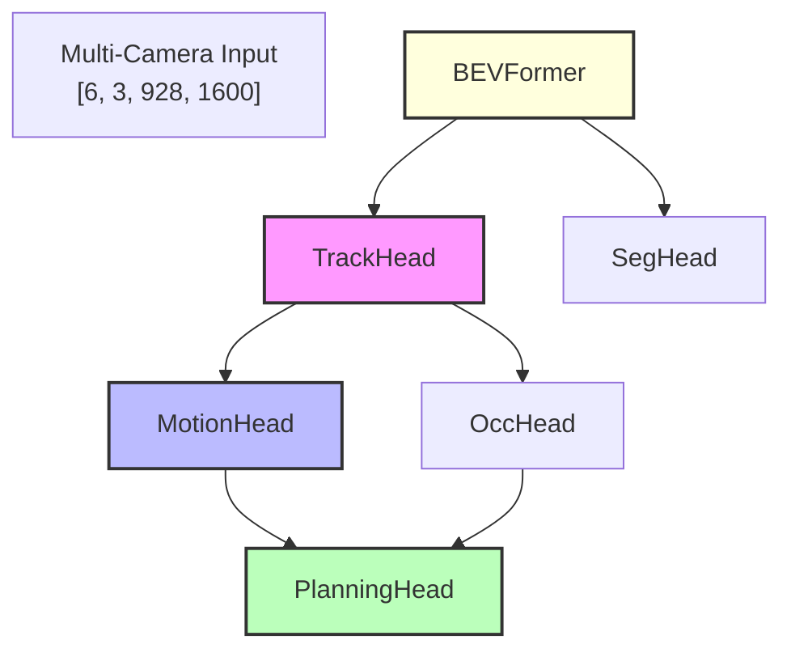

# UniAD PyTorch Operation Trace Report

**Model**: None
**Stage**: 2
**Trace Time**: 0.03 seconds

## Summary

- Total Operations: 7
- Unique Operations: 5
- Total Memory: 73.5 MB
- Total Compute Time: 0.2 ms

## Task Head Analysis


## Dataflow Visualization



## Memory Profile

### Memory Usage Heatmap

```
Operation                      | Memory (MB)  | Percentage | Visual                                  
-----------------------------------------------------------------------------------------------
Conv2d                         | 24.5         | 33.3       | █████████████░░░░░░░░░░░░░░░░░░░░░░░░░░░
ReLU                           | 24.5         | 33.3       | █████████████░░░░░░░░░░░░░░░░░░░░░░░░░░░
Conv2d                         | 12.2         | 16.7       | ██████░░░░░░░░░░░░░░░░░░░░░░░░░░░░░░░░░░
ReLU                           | 12.2         | 16.7       | ██████░░░░░░░░░░░░░░░░░░░░░░░░░░░░░░░░░░
AdaptiveAvgPool2d              | 0.0          | 0.0        | ░░░░░░░░░░░░░░░░░░░░░░░░░░░░░░░░░░░░░░░░
Flatten                        | 0.0          | 0.0        | ░░░░░░░░░░░░░░░░░░░░░░░░░░░░░░░░░░░░░░░░
Linear                         | 0.0          | 0.0        | ░░░░░░░░░░░░░░░░░░░░░░░░░░░░░░░░░░░░░░░░
-----------------------------------------------------------------------------------------------
Total                          | 73.5         | 100.0      | ████████████████████████████████████████
```

## Data Type Memory Impact Analysis

This section analyzes how different data types affect memory usage.

### Memory Usage by Precision

| Precision | Total Memory | Reduction | Notes |
|-----------|-------------|-----------|-------|
| FP32 (baseline) | 73.5 MB | 0% | Full precision |
| FP16 | 36.8 MB | 50% | Half precision |
| BF16 | 36.8 MB | 50% | Brain float |
| INT8 | 18.4 MB | 75% | Quantized |


### Mixed Precision Configurations

**default**:
- backbone: float32
- bev_encoder: float32
- task_heads: float32

**mixed_precision**:
- backbone: float16
- bev_encoder: float16
- task_heads: float32

**bfloat16**:
- backbone: bfloat16
- bev_encoder: bfloat16
- task_heads: float32

**int8_quantized**:
- backbone: int8
- bev_encoder: float16
- task_heads: float32

